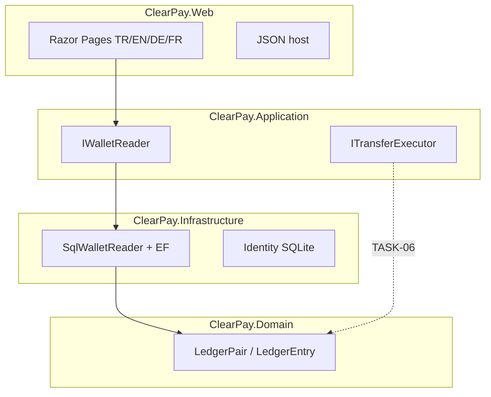

# ClearPay

<p align="center">
  <a href="README.md">English</a>
  · <a href="README.tr.md">Türkçe</a>
  · <b>Deutsch</b>
  · <a href="README.fr.md">Français</a>
</p>

<p align="center">
  <a href="https://github.com/HalilMertDeveli/clearpay/actions/workflows/ci.yml"></a>
  
  
  
  <a href="LICENSE"></a>
</p>

<p align="center"><b>Demo — gefälschtes Gateway für Aufladungen.</b> Kein lizenziertes E-Geld-Institut. Nicht Papara / FAST / keine gefälschte Filialbank.</p>

ASP.NET Core 8 **WePay-ähnliche Wallet-Website**. Man zahlt und sendet Geld **auf dieser Site**. Ein Host: Razor Pages für die UI, JSON für die API. Doppelte Buchführung liegt im Domain — `Wallet` hat **keine** Spalte `Balance`.

Ich bin Halil Mert Develi. Das ist das .NET-Interview-Repo, das ich verteidigen will (Intertech, Softtech). Lizenz MIT.

---

## Was gebaut ist


Das Web rechnet kein Ledger. Die Übersicht fragt `IWalletReader`. Heute ist der Adapter `SqlWalletReader`: Saldo = `LedgerPair.NetOf`, Monat ein/aus, letzte fünf Zeilen, Freeze-Badge. Ist SQL Server down, läuft die Site trotzdem — Nullen, kein 500.




| Schicht | Projekt | Enthält | Enthält nicht |
|---------|---------|---------|----------------|
| UI + Host | `ClearPay.Web` | Razor, Cookie, Culture-Cookie, `:5153` | Ledger-Netto, `UPDATE Balance` |
| Use Cases | `ClearPay.Application` | Ports, DTOs, FluentValidation | Connection Strings |
| Adapter | `ClearPay.Infrastructure` | EF SQL Server, Identity SQLite, Gateway-Stubs | Razor / CSS |
| Regeln | `ClearPay.Domain` | `LedgerPair`, `Wallet` (kein Saldo-Feld) | EF, HTTP, ASP.NET |

Abhängigkeiten zeigen **nach innen**. Domain kennt weder EF noch ASP.NET.

---

## Was heute klickbar ist

Cookie-Identity, SQLite unter `App_Data/identity.db`. Sprachen: **Türkçe (Standard), English, Deutsch, Français** — Umschalter im Layout, kein 9. Bildschirm.

| Bildschirm | Route | Ehrlicher Stand |
|------------|--------|------------------|
| Anmelden | `/giris` | Funktioniert |
| Registrieren | `/kayit` | Funktioniert |
| Übersicht | `/` | **Live** aus dem Ledger-Netto (Nullen ohne SQL / ohne Zeilen) |
| Überweisung | `/havale` | Formularschale; Senden deaktiviert |
| Aufladen / Abheben | `/yukle-cek` | Formularschale; Buttons deaktiviert |
| Bewegungen | `/hareketler` | Leere Tabelle; Filter aus |
| Beleg | — | Nicht gebaut |
| Admin | — | Nicht gebaut (Menü versteckt) |

`GET /api/health` → `{ "status": "ok", "product": "ClearPay" }`.

**Noch nicht im Produkt (absichtlich):** `POST /api/transfers` + HTTP **409**, Hangfire-Outbox-Worker, JWT/Swagger, Redis/Rabbit in der App, öffentliche Azure-URL.

Die **Regel** sitzt schon: derselbe `Idempotency-Key` = dieselbe Absicht → 409, keine zweite Abbuchung. Unique Key ist auf der Tabelle. Der HTTP-Endpunkt ist TASK-06.

---

## Starten

.NET-8-SDK. Docker Desktop für die Live-Übersicht aus SQL.

```bash
docker compose up -d
dotnet run --project src/ClearPay.Web --launch-profile http
```

[http://localhost:5153](http://localhost:5153). Identity braucht Docker nicht. Ohne SQL bleibt die Übersicht `0,00 ₺`.

```bash
dotnet test
dotnet build ClearPay.slnx
```

Lokales SA-Passwort steht in `.env.example`. Nur Docker. `.env` nicht committen. Nicht nach Azure übernehmen.

SQL-Datenbind: `D:\ClearPay\data\mssql` (dieser Rechner). App-Ledger ist **nur SQL Server**. MySQL/Oracle-Compose sind Beifahrer, nicht die Wallet-Datenbank.

---

## Repo-Karte

```
src/ClearPay.Domain           LedgerEntry, LedgerPair, Wallet (kein Balance)
src/ClearPay.Application      IWalletReader, ITransferExecutor, IBankGateway
src/ClearPay.Infrastructure   SqlWalletReader, EF SQL Server, Identity SQLite
src/ClearPay.Web              Razor + Lokalisierung + MapControllers
tests/ClearPay.Tests          LedgerPair, Architektur, SqlWalletReader, Culture
docker-compose.yml            SQL Server 2022 — nicht die Web-App
ClearPay.slnx
```

---

## Roadmap (ehrlich)

| Fertig | Als Nächstes |
|--------|----------------|
| TASK-01…05 — Repo, Identity, Ledger-Schema, Live-Übersicht | **TASK-06** — Überweisung, eine SQL-Transaktion, HTTP 409 |
| TASK-15 — GitHub Actions | TASK-07/08 Gateway · TASK-11 Outbox · TASK-16 Azure-URL |

CI stellt `tests/ClearPay.Tests` auf `main` wieder her und testet.

---

## Docs

- [`docs/SPEC.md`](docs/SPEC.md) — Bildschirme und Geldregeln (409, eine Transaktion, Outbox)
- [`docs/ARCHITECTURE.md`](docs/ARCHITECTURE.md) — Onion-Schichten, zuerst Cookie, dann JWT
- [`docs/FARK.md`](docs/FARK.md) — Abgleich zuerst; kein Papara-Rivale
- [`docs/SATIS.md`](docs/SATIS.md) — 15-Sekunden-Pitch
- [`docs/DEPLOY.md`](docs/DEPLOY.md) — Compose + `dotnet run`
- Schritt für Schritt: [`docs/OTURUM-PLAN.md`](docs/OTURUM-PLAN.md) (öffentlich im Repo). Dieselbe Liste in [Notion](https://www.notion.so/3bb31a8b18e4816bb34ffa405b4dec5d) — Share → Publish to web, damit Leute ohne Notion-Login lesen können.

Live-Ziel: Azure App Service + Azure SQL (West Europe). Heute gibt es keine `azurewebsites.net` zum Anklicken.

## Lizenz

[MIT](LICENSE) © 2026 Halil Mert Develi
