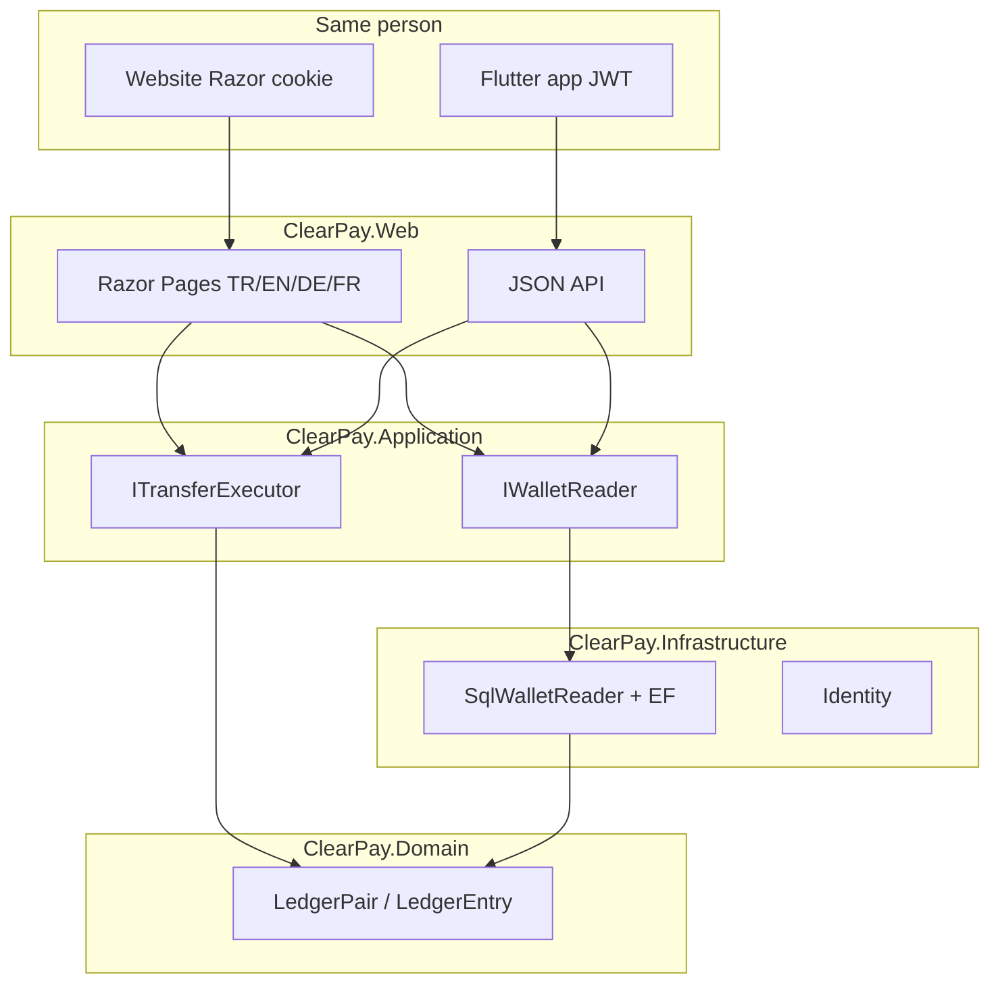

# ClearPay

<p align="center">
  <a href="README.md">English</a>
  · <a href="README.tr.md">Türkçe</a>
  · <b>Deutsch</b>
  · <a href="README.fr.md">Français</a>
</p>

<p align="center">
  <a href="https://github.com/HalilMertDeveli/clearpay/actions/workflows/ci.yml"></a>
  
  
  
  
  <a href="LICENSE"></a>
</p>

<p align="center"><b>Demo — gefälschtes Gateway für Aufladungen.</b> Kein lizenziertes E-Geld-Institut. Nicht Papara / FAST / keine gefälschte Filialbank.</p>

**Ein Wallet, zwei Clients.** Dieselbe Person meldet sich an, überweist, lädt auf und öffnet den Beleg **auf der Website** und **in der Flutter-App**. Ein SQL-Ledger. Das Telefon hält keinen zweiten Saldo.

ASP.NET Core 8 **WePay-ähnliche Wallet-Website** plus **Flutter**-JWT-Client ([`mobile/clearpay`](mobile/clearpay)). Razor Pages für den Browser (Cookie); JSON für die App (JWT). Doppelte Buchführung liegt im Domain — `Wallet` hat **keine** Spalte `Balance`.

Ich bin Halil Mert Develi. Das ist das .NET-Interview-Repo, das ich verteidigen will (Intertech, Softtech). Lizenz MIT.

---

## Was gebaut ist


Das Web rechnet kein Ledger. Die Übersicht fragt `IWalletReader`. Heute ist der Adapter `SqlWalletReader`: Saldo = `LedgerPair.NetOf`, Monat ein/aus, letzte fünf Zeilen, Freeze-Badge. Ist SQL Server down, läuft die Site trotzdem — Nullen, kein 500.




| Schicht | Projekt | Enthält | Enthält nicht |
|---------|---------|---------|----------------|
| UI + Host | `ClearPay.Web` | Razor, Cookie, Culture-Cookie, `:5153` | Ledger-Netto, `UPDATE Balance` |
| Use Cases | `ClearPay.Application` | Ports, DTOs, FluentValidation | Connection Strings |
| Adapter | `ClearPay.Infrastructure` | EF SQL Server, Identity SQLite, Gateway-Stubs | Razor / CSS |
| Regeln | `ClearPay.Domain` | `LedgerPair`, `Wallet` (kein Saldo-Feld) | EF, HTTP, ASP.NET |

Abhängigkeiten zeigen **nach innen**. Domain kennt weder EF noch ASP.NET.

---

## Was heute klickbar ist

Dieselben acht Vorgänge auf der Site und in der App. Sprachen: **Türkçe (Standard), English, Deutsch, Français**. Flutter-UI Standard: Türkçe. Kein 9. Bildschirm.

| Vorgang | Website | Flutter-App |
|---------|---------|-------------|
| Anmelden | [`/giris`](http://localhost:5153/giris) | Giriş — `POST /api/token` |
| Registrieren | [`/kayit`](http://localhost:5153/kayit) | Hesap oluştur — `POST /api/register` |
| Übersicht | [`/`](http://localhost:5153/) | Özet, Pull-to-refresh — `GET /api/wallet` |
| Überweisung | [`/havale`](http://localhost:5153/havale) | Havale + Bestätigung — `POST /api/transfers` + `Idempotency-Key` |
| Aufladen / Abheben | [`/yukle-cek`](http://localhost:5153/yukle-cek) | Yükle / Çek — `POST /api/topup` / `withdraw` |
| Bewegungen | [`/hareketler`](http://localhost:5153/hareketler) | Hareketler + Filter — `GET /api/movements` |
| Beleg | [`/dekont/{id}`](http://localhost:5153/hareketler) | Dekont — `GET /api/receipts/{id}` |
| Admin | [`/admin`](http://localhost:5153/admin) | Admin-Tab (Rolle Admin) — `/api/admin/*` |

Dev: `admin@clearpay.test` / `Deneme123`. Transfer **201** / Replay **409**. OpenAPI: [http://localhost:5153/swagger](http://localhost:5153/swagger). Mobile-README: [`mobile/clearpay/README.md`](mobile/clearpay/README.md).

Redis cached nur das Özet-DTO (~60s). Kasse bleibt SQL Server. Rabbit `clearpay.outbox`, wenn `ConnectionStrings:RabbitMq` gesetzt. **Keine öffentliche Azure-URL** — du klickst `az login` (`docs/CANLI.md`).

## Interview (drei Sätze)

1. Derselbe `Idempotency-Key` ist dieselbe Absicht: der zweite HTTP ist **409 Conflict**, damit ein Timeout-Retry nicht zweimal abbucht.
2. Soll, Haben, Transfer, Idempotenz, Audit und Outbox in **einer SQL-Transaktion**; kein `UPDATE Balance` — Saldo ist `LedgerPair.NetOf`.
3. Die Outbox-Zeile steht in derselben Transaktion; Timeout verliert die Nachricht nicht. Hangfire (und Rabbit, wenn gebunden) publiziert nach dem Commit.

---

## Starten

.NET-8-SDK. Docker Desktop für die Live-Übersicht aus SQL.

```bash
docker compose up -d
dotnet run --project src/ClearPay.Web --launch-profile http
```

[http://localhost:5153](http://localhost:5153). Dasselbe Geld in Flutter (**cmd**):

```bat
cd /d mobile\clearpay
flutter doctor
flutter run -d windows
```

Android-Emulator: `http://10.0.2.2:5153`. Identity braucht Docker nicht. Ohne SQL bleibt die Übersicht `0,00 ₺`.

```bash
dotnet test
dotnet build ClearPay.slnx
```

Lokales SA-Passwort steht in `.env.example`. Nur Docker. `.env` nicht committen. Nicht nach Azure übernehmen.

SQL-Datenbind: `D:\ClearPay\data\mssql` (dieser Rechner). App-Ledger ist **nur SQL Server**. MySQL/Oracle-Compose sind Beifahrer, nicht die Wallet-Datenbank.

---

## Repo-Karte

```
src/ClearPay.Domain           LedgerEntry, LedgerPair, Wallet (kein Balance)
src/ClearPay.Application      IWalletReader, ITransferExecutor, IBankGateway
src/ClearPay.Infrastructure   SqlWalletReader, EF SQL Server, Identity SQLite
src/ClearPay.Web              Razor + Lokalisierung + MapControllers
mobile/clearpay               Flutter-JWT-Client (nicht in der .slnx)
tests/ClearPay.Tests          LedgerPair, Architektur, SqlWalletReader, Culture
docker-compose.yml            SQL Server 2022 — nicht die Web-App
ClearPay.slnx
```

---

## Roadmap (ehrlich)

| Fertig | Als Nächstes |
|--------|----------------|
| TASK-01…15 — Screens, Ledger, 409, Gateway, Outbox, Redis/Rabbit, Tests, Swagger | **TASK-16** — Azure App Service + Azure SQL (`az login` klickst du; keine erfundene URL) |

CI stellt `tests/ClearPay.Tests` auf `main` wieder her und testet.

---

## Docs

- [`docs/SPEC.md`](docs/SPEC.md) — Bildschirme und Geldregeln (409, eine Transaktion, Outbox)
- [`docs/ARCHITECTURE.md`](docs/ARCHITECTURE.md) — Onion-Schichten, zuerst Cookie, dann JWT
- [`docs/FARK.md`](docs/FARK.md) — Abgleich zuerst; kein Papara-Rivale
- [`docs/SATIS.md`](docs/SATIS.md) — 15-Sekunden-Pitch
- [`docs/DEPLOY.md`](docs/DEPLOY.md) — Compose + `dotnet run`
- [`mobile/clearpay/README.md`](mobile/clearpay/README.md) — Flutter-Client (dieselben acht Vorgänge)
- Schritt für Schritt: [`docs/OTURUM-PLAN.md`](docs/OTURUM-PLAN.md) (öffentlich im Repo). Dieselbe Liste in [Notion](https://www.notion.so/3bb31a8b18e4816bb34ffa405b4dec5d) — Share → Publish to web, damit Leute ohne Notion-Login lesen können.

Live-Ziel: Azure App Service + Azure SQL (West Europe). Heute gibt es keine `azurewebsites.net` zum Anklicken.

## Lizenz

[MIT](LICENSE) © 2026 Halil Mert Develi
