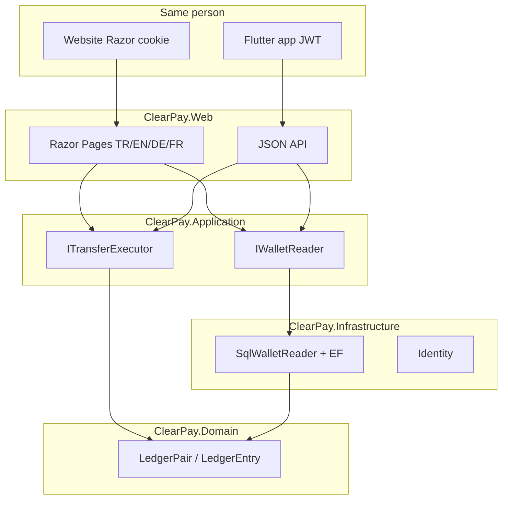

# ClearPay

<p align="center">
  <a href="README.md">English</a>
  · <a href="README.tr.md">Türkçe</a>
  · <a href="README.de.md">Deutsch</a>
  · <b>Français</b>
</p>

<p align="center">
  <a href="https://github.com/HalilMertDeveli/clearpay/actions/workflows/ci.yml"></a>
  
  
  
  
  <a href="LICENSE"></a>
</p>

<p align="center"><b>Démo — passerelle fictive pour les recharges.</b> Pas un établissement e-money licencié. Pas Papara / FAST / une fausse banque de détail.</p>

**Un portefeuille, deux clients.** La même personne se connecte, vire, recharge et ouvre le reçu **sur le site** et **dans l’app Flutter**. Un seul grand livre SQL. Le téléphone ne garde pas un second solde.

Portefeuille web ASP.NET Core 8 **type WePay** plus client **Flutter** JWT ([`mobile/clearpay`](mobile/clearpay)). Razor Pages pour le navigateur (cookie) ; JSON pour l’app (JWT). La partie double est dans le Domain — `Wallet` n’a **pas** de colonne `Balance`.

Je suis Halil Mert Develi. J’ai écrit ça pour un entretien .NET (Intertech, Softtech), pas pour cloner Papara. Licence MIT.

---

## Ce qui est construit


Le Web ne calcule pas le grand livre. La synthèse demande `IWalletReader`. Aujourd’hui l’adaptateur est `SqlWalletReader` : solde = `LedgerPair.NetOf`, mois entrées/sorties, cinq dernières lignes, badge gel. Si SQL Server est down, le site s’ouvre quand même — des zéros, pas un 500.




| Couche | Projet | Contient | Ne contient pas |
|--------|--------|----------|-----------------|
| UI + hôte | `ClearPay.Web` | Razor, cookie, culture, `:5153` | Net du ledger, `UPDATE Balance` |
| Cas d’usage | `ClearPay.Application` | Ports, DTO, FluentValidation | Chaînes de connexion |
| Adaptateurs | `ClearPay.Infrastructure` | EF SQL Server, Identity SQLite, stubs gateway | Razor / CSS |
| Règles | `ClearPay.Domain` | `LedgerPair`, `Wallet` (pas de champ solde) | EF, HTTP, ASP.NET |

Les dépendances pointent **vers l’intérieur**. Le Domain ne référence ni EF ni ASP.NET.

---

## Ce qui s’ouvre aujourd’hui

Les huit mêmes opérations sur le site et dans l’app. Langues : **Türkçe (défaut), English, Deutsch, Français**. UI Flutter par défaut : Türkçe. Pas un 9ᵉ écran.

| Opération | Site | App Flutter |
|-----------|------|-------------|
| Connexion | [`/giris`](http://localhost:5153/giris) | Giriş — `POST /api/token` |
| Inscription | [`/kayit`](http://localhost:5153/kayit) | Hesap oluştur — `POST /api/register` |
| Synthèse | [`/`](http://localhost:5153/) | Özet, pull-to-refresh — `GET /api/wallet` |
| Virement | [`/havale`](http://localhost:5153/havale) | Havale + confirmation — `POST /api/transfers` + `Idempotency-Key` |
| Recharger / retirer | [`/yukle-cek`](http://localhost:5153/yukle-cek) | Yükle / Çek — `POST /api/topup` / `withdraw` |
| Mouvements | [`/hareketler`](http://localhost:5153/hareketler) | Hareketler + filtre — `GET /api/movements` |
| Reçu | [`/dekont/{id}`](http://localhost:5153/hareketler) | Dekont — `GET /api/receipts/{id}` |
| Admin | [`/admin`](http://localhost:5153/admin) | Onglet Admin (rôle Admin) — `/api/admin/*` |

Dev : `admin@clearpay.test` / `Deneme123`. Virement **201** / rejeu **409**. OpenAPI : [http://localhost:5153/swagger](http://localhost:5153/swagger). README mobile : [`mobile/clearpay/README.md`](mobile/clearpay/README.md).

Redis cache uniquement le DTO résumé (~60 s). La caisse reste SQL Server. Rabbit `clearpay.outbox` si `ConnectionStrings:RabbitMq`. **Pas d’URL Azure publique** — tu cliques `az login` (`docs/CANLI.md`).

## Entretien (trois phrases)

1. La même `Idempotency-Key` est la même intention : le second HTTP est **409 Conflict**, un retry après timeout ne débite pas deux fois.
2. Débit, crédit, transfert, idempotence, audit et outbox dans **une transaction SQL** ; pas d’`UPDATE Balance` — le solde est `LedgerPair.NetOf`.
3. La ligne outbox est écrite dans cette transaction ; un timeout ne perd pas le message. Hangfire (et Rabbit s’il est lié) publie après le commit.

---

## Lancer

SDK .NET 8. Docker Desktop pour la synthèse live depuis SQL.

```bash
docker compose up -d
dotnet run --project src/ClearPay.Web --launch-profile http
```

[http://localhost:5153](http://localhost:5153). Le même argent dans Flutter (**cmd**) :

```bat
cd /d mobile\clearpay
flutter doctor
flutter run -d windows
```

Émulateur Android : `http://10.0.2.2:5153`. Identity n’a pas besoin de Docker. Sans SQL, la synthèse reste `0,00 ₺`.

```bash
dotnet test
dotnet build ClearPay.slnx
```

Mot de passe SA local : `.env.example`. Docker uniquement. Ne pas committer `.env`. Ne pas le réutiliser sur Azure.

Bind des données SQL : `D:\ClearPay\data\mssql` (cette machine). Le grand livre de l’app est **SQL Server seulement**. MySQL/Oracle compose sont des sidecars, pas la base du portefeuille.

---

## Carte du dépôt

```
src/ClearPay.Domain           LedgerEntry, LedgerPair, Wallet (pas de Balance)
src/ClearPay.Application      IWalletReader, ITransferExecutor, IBankGateway
src/ClearPay.Infrastructure   SqlWalletReader, EF SQL Server, Identity SQLite
src/ClearPay.Web              Razor + localisation + MapControllers
mobile/clearpay               client Flutter JWT (pas dans le .slnx)
tests/ClearPay.Tests          LedgerPair, architecture, SqlWalletReader, culture
docker-compose.yml            SQL Server 2022 — pas l’app web
ClearPay.slnx
```

---

## Feuille de route (honnête)

| Fait | Ensuite |
|------|---------|
| TASK-01…15 — écrans, ledger, 409, gateway, outbox, Redis/Rabbit, tests, Swagger | **TASK-16** — Azure App Service + Azure SQL (`az login` à toi ; pas d’URL inventée) |

La CI restore et teste `tests/ClearPay.Tests` sur `main`.

---

## Docs

- [`docs/YOL.md`](docs/YOL.md) — à quoi ça sert, où ça va (carrière d’abord ; URL live = TASK-16)
- [`docs/SPEC.md`](docs/SPEC.md) — écrans et règles d’argent (409, une transaction, outbox)
- [`docs/ARCHITECTURE.md`](docs/ARCHITECTURE.md) — couches onion, cookie puis JWT
- [`docs/FARK.md`](docs/FARK.md) — rapprochement d’abord ; pas un rival Papara
- [`docs/SATIS.md`](docs/SATIS.md) — pitch 15 secondes
- [`docs/DEPLOY.md`](docs/DEPLOY.md) — Compose + `dotnet run`
- [`mobile/clearpay/README.md`](mobile/clearpay/README.md) — client Flutter (les huit mêmes opérations)
- Pas à pas : [`docs/OTURUM-PLAN.md`](docs/OTURUM-PLAN.md) (public dans ce dépôt). Même liste sur [Notion](https://www.notion.so/3bb31a8b18e4816bb34ffa405b4dec5d) — Share → Publish to web pour les lecteurs sans compte Notion.

Cible live : Azure App Service + Azure SQL (West Europe). Pas d’`azurewebsites.net` à cliquer aujourd’hui.

## Licence

[MIT](LICENSE) © 2026 Halil Mert Develi
