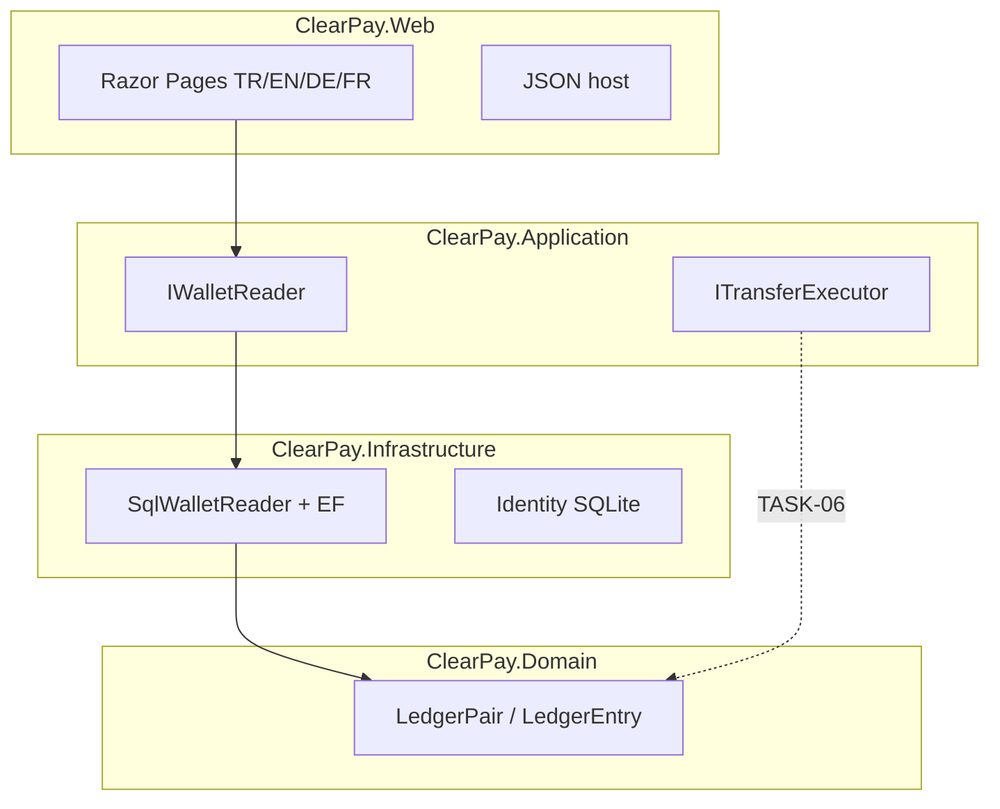

# ClearPay

<p align="center">
  <a href="README.md">English</a>
  · <a href="README.tr.md">Türkçe</a>
  · <a href="README.de.md">Deutsch</a>
  · <b>Français</b>
</p>

<p align="center">
  <a href="https://github.com/HalilMertDeveli/clearpay/actions/workflows/ci.yml"></a>
  
  
  
  <a href="LICENSE"></a>
</p>

<p align="center"><b>Démo — passerelle fictive pour les recharges.</b> Pas un établissement e-money licencié. Pas Papara / FAST / une fausse banque de détail.</p>

Portefeuille web ASP.NET Core 8 **type WePay**. On paie et on envoie de l’argent **sur ce site**. Un seul hôte : Razor Pages pour l’UI, JSON pour l’API. La partie double est dans le Domain — `Wallet` n’a **pas** de colonne `Balance`.

Je suis Halil Mert Develi. J’ai écrit ça pour un entretien .NET (Intertech, Softtech), pas pour cloner Papara. Licence MIT.

---

## Ce qui est construit


Le Web ne calcule pas le grand livre. La synthèse demande `IWalletReader`. Aujourd’hui l’adaptateur est `SqlWalletReader` : solde = `LedgerPair.NetOf`, mois entrées/sorties, cinq dernières lignes, badge gel. Si SQL Server est down, le site s’ouvre quand même — des zéros, pas un 500.




| Couche | Projet | Contient | Ne contient pas |
|--------|--------|----------|-----------------|
| UI + hôte | `ClearPay.Web` | Razor, cookie, culture, `:5153` | Net du ledger, `UPDATE Balance` |
| Cas d’usage | `ClearPay.Application` | Ports, DTO, FluentValidation | Chaînes de connexion |
| Adaptateurs | `ClearPay.Infrastructure` | EF SQL Server, Identity SQLite, stubs gateway | Razor / CSS |
| Règles | `ClearPay.Domain` | `LedgerPair`, `Wallet` (pas de champ solde) | EF, HTTP, ASP.NET |

Les dépendances pointent **vers l’intérieur**. Le Domain ne référence ni EF ni ASP.NET.

---

## Ce qui s’ouvre aujourd’hui

Identity cookie, SQLite : `App_Data/identity.db`. Langues : **Türkçe (défaut), English, Deutsch, Français** — sélecteur dans le layout, pas un 9ᵉ écran.

| Écran | Route | État honnête |
|-------|--------|----------------|
| Connexion | `/giris` | OK |
| Inscription | `/kayit` | OK |
| Synthèse | `/` | **Live** depuis le net du ledger (zéros sans SQL / sans lignes) |
| Virement | `/havale` | Formulaire ; Envoyer désactivé |
| Recharger / retirer | `/yukle-cek` | Formulaire ; boutons désactivés |
| Mouvements | `/hareketler` | Table vide ; filtres off |
| Reçu | — | Pas encore |
| Admin | — | Pas encore (menu caché) |

`GET /api/health` → `{ "status": "ok", "product": "ClearPay" }`.

**Pas encore dans le produit (volontairement) :** `POST /api/transfers` + HTTP **409**, worker Hangfire outbox, JWT/Swagger, Redis/Rabbit dans l’app, URL Azure publique.

La **règle** est déjà verrouillée : même `Idempotency-Key` = même intention → 409, pas un second débit. La clé unique est sur la table. L’endpoint HTTP est TASK-06.

---

## Lancer

SDK .NET 8. Docker Desktop pour la synthèse live depuis SQL.

```bash
docker compose up -d
dotnet run --project src/ClearPay.Web --launch-profile http
```

[http://localhost:5153](http://localhost:5153). Identity n’a pas besoin de Docker. Sans SQL, la synthèse reste `0,00 ₺`.

```bash
dotnet test
dotnet build ClearPay.slnx
```

Mot de passe SA local : `.env.example`. Docker uniquement. Ne pas committer `.env`. Ne pas le réutiliser sur Azure.

Bind des données SQL : `D:\ClearPay\data\mssql` (cette machine). Le grand livre de l’app est **SQL Server seulement**. MySQL/Oracle compose sont des sidecars, pas la base du portefeuille.

---

## Carte du dépôt

```
src/ClearPay.Domain           LedgerEntry, LedgerPair, Wallet (pas de Balance)
src/ClearPay.Application      IWalletReader, ITransferExecutor, IBankGateway
src/ClearPay.Infrastructure   SqlWalletReader, EF SQL Server, Identity SQLite
src/ClearPay.Web              Razor + localisation + MapControllers
tests/ClearPay.Tests          LedgerPair, architecture, SqlWalletReader, culture
docker-compose.yml            SQL Server 2022 — pas l’app web
ClearPay.slnx
```

---

## Feuille de route (honnête)

| Fait | Ensuite |
|------|---------|
| TASK-01…05 — repo, Identity, schéma ledger, synthèse live | **TASK-06** — virement, une transaction SQL, HTTP 409 |
| TASK-15 — GitHub Actions | TASK-07/08 gateway · TASK-11 outbox · TASK-16 URL Azure |

La CI restore et teste `tests/ClearPay.Tests` sur `main`.

---

## Docs

- [`docs/SPEC.md`](docs/SPEC.md) — écrans et règles d’argent (409, une transaction, outbox)
- [`docs/ARCHITECTURE.md`](docs/ARCHITECTURE.md) — couches onion, cookie puis JWT
- [`docs/FARK.md`](docs/FARK.md) — rapprochement d’abord ; pas un rival Papara
- [`docs/SATIS.md`](docs/SATIS.md) — pitch 15 secondes
- [`docs/DEPLOY.md`](docs/DEPLOY.md) — Compose + `dotnet run`
- Pas à pas : [`docs/OTURUM-PLAN.md`](docs/OTURUM-PLAN.md) (public dans ce dépôt). Même liste sur [Notion](https://www.notion.so/3bb31a8b18e4816bb34ffa405b4dec5d) — Share → Publish to web pour les lecteurs sans compte Notion.

Cible live : Azure App Service + Azure SQL (West Europe). Pas d’`azurewebsites.net` à cliquer aujourd’hui.

## Licence

[MIT](LICENSE) © 2026 Halil Mert Develi
