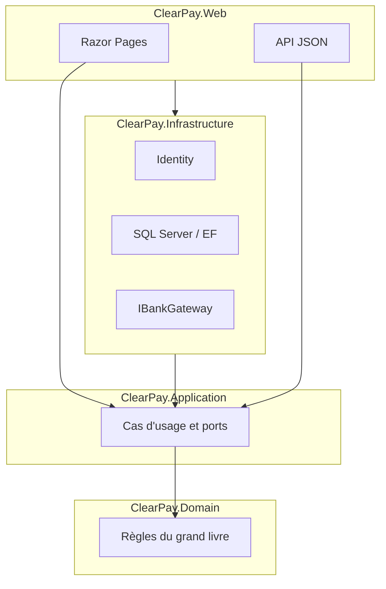

# ClearPay

[English](README.md) | [Türkçe](README.tr.md) | **Français**

[](https://dotnet.microsoft.com/download/dotnet/8.0)
[](https://learn.microsoft.com/dotnet/csharp/)
[](LICENSE)
[](#état)

Portefeuille démo ASP.NET Core 8 : virements P2P idempotents, grand livre en partie double sur SQL Server, passerelle bancaire fictive (REST + SOAP) et outbox pour qu’un timeout HTTP ne fasse pas disparaître un paiement.

> [!WARNING]
> **Démo — ce n’est pas une banque réelle.** Pas de POS live, de FAST, d’acquisition carte ni de licence e-money. ClearPay **n’est pas** un concurrent de Papara (ni Tosla / Paycell / ininal). L’interface est en turc. Les captures d’écran viendront quand les huit écrans seront stables ; aucune n’est inventée ici.

## Sommaire

- [Produit](#produit)
- [Huit écrans](#huit-écrans)
- [Architecture](#architecture)
- [Pile technique](#pile-technique)
- [Pourquoi 409, la transaction et l’outbox](#pourquoi-409-la-transaction-et-loutbox)
- [Lancer en local](#lancer-en-local)
- [Organisation du dépôt](#organisation-du-dépôt)
- [État](#état)
- [Documentation](#documentation)
- [Licence](#licence)

## Produit

Un utilisateur inscrit voit un solde en TL, envoie de l’argent à un autre utilisateur, recharge ou retire via une banque **fictive**, et ouvre l’historique plus un reçu. Un admin peut geler un portefeuille et chercher dans l’audit.

L’histoire d’entretien que ce dépôt doit prouver : chaque kuruş a une ligne `+` et une ligne `−` dans **votre** grand livre ; la même `Idempotency-Key` ne débite jamais deux fois ; un timeout n’efface pas l’intention. Le solde n’est jamais « corrigé » par un `UPDATE` silencieux.

## Huit écrans

Liste produit figée ([`docs/SPEC.md`](docs/SPEC.md)). Pas de panneau marchand, pas de vrai POS.

| # | Écran | Ce que l’on voit |
|---|--------|------------------|
| 1 | Connexion | E-mail, mot de passe, lien créer un compte |
| 2 | Inscription | Nom, e-mail, mot de passe, confirmation |
| 3 | Synthèse du portefeuille | Solde, entrées/sorties du mois, 5 derniers mouvements |
| 4 | Virement (Havale) | Destinataire, montant, libellé, solde restant |
| 5 | Recharger / retirer | Banque fictive, montant, champ type IBAN ; succès ou timeout |
| 6 | Mouvements | Date, n°, type, contrepartie, montant, statut ; filtre + pagination |
| 7 | Reçu (Dekont) | Parties, montant, correlation id, horodatage |
| 8 | Admin | Gel d’utilisateur, file en échec, recherche d’audit |

Menu gauche (identique partout) : **Özet**, **Havale**, **Yükle/Çek**, **Hareketler**. **Admin** selon le rôle (masqué jusqu’à TASK-10).

Pas encore de galerie de captures — elles seront ajoutées quand les huit écrans seront stables. Les maquettes ne sont pas publiées comme photos produit.

## Architecture

Un seul hôte ASP.NET Core 8 (Razor Pages + API JSON). Clean Architecture, quatre projets. Le Domain ne dépend ni de HTTP ni d’EF.



| Projet | Contient | Ne contient pas |
|--------|----------|-----------------|
| `ClearPay.Domain` | Rôles, règles d’argent, sens de `LedgerEntry` | HTTP, EF, Razor |
| `ClearPay.Application` | Cas d’usage, DTO, FluentValidation, ports | Chaînes de connexion, cookies |
| `ClearPay.Infrastructure` | Identity, SQL, EF/Dapper, Hangfire, passerelle banque | Razor, CSS |
| `ClearPay.Web` | Pages + API JSON, hôte cookie/JWT | Calcul du grand livre, « rustines » de solde |

Dépendances : Web → Application + Infrastructure ; Infrastructure → Application → Domain.

## Pile technique

| Couche | Aujourd’hui | Prévu |
|--------|-------------|--------|
| Langage / runtime | C# 12, **.NET 8** | — |
| Web | ASP.NET Core : Razor Pages + Web API, un hôte | JWT + OpenAPI/Swagger (TASK-06 / TASK-14) |
| Données | **SQL Server** Docker (Compose) ; Identity **SQLite** (`App_Data`) | EF Core sur SQL Server pour le grand livre (TASK-04) ; Dapper / T-SQL pour les listes |
| Identité | ASP.NET Identity **cookie** (site) | **JWT** pour `POST /api/transfers` |
| Validation / tests | FluentValidation, **xUnit**, FluentAssertions, WebApplicationFactory | Tests 409 + invariant de solde (TASK-13) |
| Ops | Docker Compose (SQL uniquement) | Hangfire + worker outbox (TASK-11) ; Redis + RabbitMQ (TASK-12) |
| CI / prod | — | GitHub Actions (TASK-15) ; **Azure App Service** Linux + Azure SQL, West Europe (TASK-16) |

Serilog (corrélation), Hangfire, Redis et RabbitMQ sont au plan, pas encore en références de paquets. Le badge build ci-dessus est un **placeholder** jusqu’à TASK-15.

## Pourquoi 409, la transaction et l’outbox

| Pourquoi | Ce que le code doit faire |
|----------|---------------------------|
| **409 Conflict** | La même `Idempotency-Key` = la même intention. Un second `201` débiterait deux fois. Rejeu → **409** ; pas de second débit. |
| **Une transaction SQL** | Débit, crédit, ligne de virement, idempotence, audit et insert outbox : tout commit ensemble, ou rien. |
| **Outbox** | La vérité, c’est l’écriture du grand livre. Le message est publié **après** le commit pour qu’un timeout HTTP ne le perde pas. |

Le 409 HTTP est **TASK-06**. Le worker outbox est **TASK-11**. Les règles de partie double sont déjà sous `ClearPay.Domain/Ledger`. Il n’y a pas d’helper `UPDATE Balance`.

## Lancer en local

**Prérequis**

- [.NET 8 SDK](https://dotnet.microsoft.com/download/dotnet/8.0)
- [Docker](https://docs.docker.com/get-docker/) pour SQL Server (Compose). Connexion et inscription fonctionnent sans Docker jusqu’à TASK-04 (Identity en SQLite).

```bash
docker compose up -d
dotnet run --project src/ClearPay.Web --launch-profile http
```

Ouvrir [http://localhost:5153](http://localhost:5153) — connexion `/Account/Login`, inscription `/Account/Register`, puis synthèse vide (`0,00 ₺`).

```bash
dotnet test
dotnet build ClearPay.slnx
```

SQL écoute sur `localhost,1433`. L’application **ne lit pas encore** SQL Server (TASK-04). Le mot de passe SA local est dans `.env.example` (`ClearPay_Dev1!`) — Docker uniquement ; jamais sur Azure. Ne pas committer `.env`.

## Organisation du dépôt

```
clearpay/
├── src/
│   ├── ClearPay.Domain/          # règles d'argent, rôles
│   ├── ClearPay.Application/     # cas d'usage, ports, validateurs
│   ├── ClearPay.Infrastructure/  # Identity, persistance, passerelles
│   └── ClearPay.Web/             # hôte Razor + API (:5153)
├── tests/
│   └── ClearPay.Tests/           # xUnit
├── docs/                         # SPEC, PLAN, architecture, bureaux
├── docker-compose.yml            # SQL Server 2022
└── ClearPay.slnx
```

## État

| Fait | Ensuite |
|------|---------|
| TASK-01 docs + rôles d’agents | **TASK-04** modèle SQL + squelette du grand livre |
| TASK-02 solution, layout, Compose SQL | TASK-05 synthèse portefeuille live |
| TASK-03 connexion, inscription, synthèse vide | TASK-06 havale + **409** |

TASK-03 (connexion, inscription, synthèse vide `0,00 ₺`) est marqué Done ; Identity cookie sur SQLite est dans cet arbre. Si `/Account/Login` renvoie 404, le clone est en retard sur ce commit. JWT, grand livre sur SQL, HTTP banque fictive, Hangfire, CI et URL Azure publique **ne sont pas** livrés. File : [`docs/TASKS.md`](docs/TASKS.md). Plan live (pas de publish tant que vous n’ouvrez pas Azure) : [`docs/CANLI.md`](docs/CANLI.md).

**Puces CV (cible ; ce n’est pas l’affirmation que chaque ligne est déjà prouvée en HTTP) :**

- Built ClearPay, an ASP.NET Core 8 wallet with idempotent P2P transfers, JWT/cookie auth, and a double-entry ledger on SQL Server.
- Integrated a mock bank gateway over REST and SOAP; used an outbox + queue so payment completion is not lost on timeout.
- Shipped Docker Compose, xUnit tests, Serilog correlation, and CI/CD to Azure App Service.

Jusqu’à TASK-06 / TASK-11 / TASK-16 : les **règles sont verrouillées** ; la preuve HTTP est encore dans la file.

## Documentation

| Doc | Rôle |
|-----|------|
| [SPEC](docs/SPEC.md) | Produit, huit écrans, règles d’argent |
| [PLAN](docs/PLAN.md) | Travail par phases ; une TASK à la fois |
| [ARCHITECTURE](docs/ARCHITECTURE.md) | Couches, routes, cookie puis JWT |
| [TASKS](docs/TASKS.md) | Todo / Doing / Done |
| [CANLI](docs/CANLI.md) | Q1 Azure App Service + Azure SQL (vous ouvrez le compte) |
| [DEPLOY](docs/DEPLOY.md) | Compose local + `dotnet run` |
| [FARK](docs/FARK.md) | Grand livre orienté rapprochement ; pas un rival Papara |
| [URUN](docs/URUN.md) | Qui voit quoi ; critères d’acceptation |
| [KRONIK](docs/KRONIK.md) | Chronique d’apprentissage (turc) |
| [İK](docs/IK.md) | CV candidat / script d’entretien (pas de recrutement) |
| [FINANS](docs/FINANS.md) | Partie double, correlation id |
| [TARTISMA](docs/TARTISMA.md) | Journal discuter-puis-agir |
| [AGENTS](docs/AGENTS.md) | Orchestrator, Coder, Payments, … |
| [Çalışma planı](docs/CALISMA-PLANI.md) | Séquence d’agents + portes de test |
| [Yönetici raporu](docs/YONETICI-RAPORU.md) | Statut / RAG |
| [Öğrenme](docs/OGRENME.md) | Pourquoi c’est construit ainsi |
| [Senin işlerin](docs/SENIN-ISLERIN.md) | Checklist humaine uniquement |
| [Ödeme (senin)](docs/ODEME-SENIN.md) | Argent démo : ce que vous faites / ne faites pas |
| [SATIS](docs/SATIS.md) | Pitch d’entretien |
| [PR](docs/PR.md) | Classement honnête (pas n°1 vs Papara) |
| [PAZARLAMA](docs/PAZARLAMA.md) | GitHub / LinkedIn / URL démo |
| [DESTEK](docs/DESTEK.md) | FAQ démo (pas un helpdesk bancaire) |
| [ORGANIZASYON](docs/ORGANIZASYON.md) | « Bureaux » démo (pas un organigramme de banque) |
| [MARKA](docs/MARKA.md) / [TASARIM](docs/TASARIM.md) | Wordmark, navy `#1B2A4A` |
| [SEO](docs/SEO.md) / [ADS](docs/ADS.md) | Meta / pubs après une URL live |

## Licence

[MIT](LICENSE). Les contributions suivent la liste d’écrans de [`docs/SPEC.md`](docs/SPEC.md) et [`docs/TARTISMA.md`](docs/TARTISMA.md) avant de modifier `src/`.
