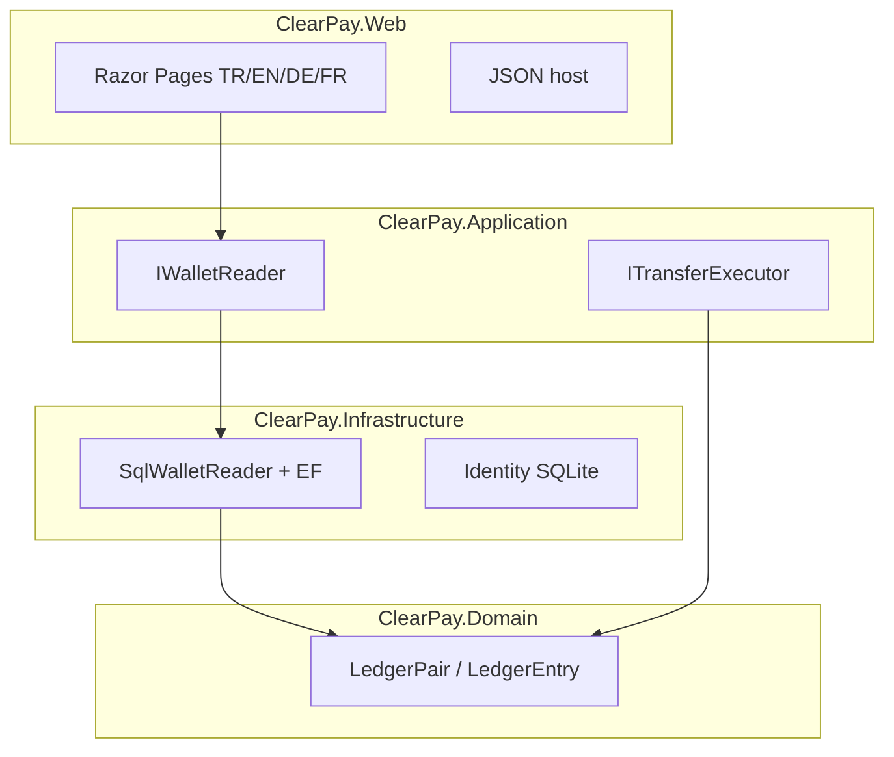

# ClearPay

<p align="center">
  <b>English</b>
  · <a href="README.tr.md">Türkçe</a>
  · <a href="README.de.md">Deutsch</a>
  · <a href="README.fr.md">Français</a>
</p>

<p align="center">
  <a href="https://github.com/HalilMertDeveli/clearpay/actions/workflows/ci.yml"></a>
  
  
  
  <a href="LICENSE"></a>
</p>

<p align="center"><b>Demo — fake gateway for top-ups.</b> Not a licensed e-money institution. Not Papara / FAST / a fake retail bank.</p>

ASP.NET Core 8 **WePay-like wallet website**. People pay and send money **on this site**. One host: Razor Pages for the UI, JSON for the API. Double-entry lives in Domain — `Wallet` has **no** `Balance` column.

I am Halil Mert Develi. I wrote this as the .NET interview repo I actually want to defend (Intertech, Softtech, that kind of shop). MIT licence.

---

## Picture of the build


Web never computes ledger math. The özet (summary) page asks `IWalletReader`. Today that adapter is `SqlWalletReader`: balance = `LedgerPair.NetOf`, this month in/out, last five rows, freeze badge. If SQL Server is down you still get the site — zeros, not a 500.




| Layer | Project | Holds | Must not hold |
|-------|---------|-------|----------------|
| UI + host | `ClearPay.Web` | Razor, cookie, culture cookie, `:5153` | Ledger net, `UPDATE Balance` |
| Use cases | `ClearPay.Application` | Ports, DTOs, FluentValidation | Connection strings |
| Adapters | `ClearPay.Infrastructure` | EF SQL Server, Identity SQLite, gateway stubs | Razor / CSS |
| Rules | `ClearPay.Domain` | `LedgerPair`, `Wallet` (no balance field) | EF, HTTP, ASP.NET |

Dependencies point **inward**. Domain does not reference EF or ASP.NET.

---

## What you can click today

Cookie Identity, SQLite at `App_Data/identity.db`. Site language: **Türkçe (default), English, Deutsch, Français** — picker in the layout, not a 9th screen.

| Screen | Route | Honest state |
|--------|--------|----------------|
| Sign in | `/giris` | Works |
| Register | `/kayit` | Works |
| Summary | `/` | **Live** from ledger net (zeros if no SQL / no rows) |
| Transfer | `/havale` | Cookie form → `ITransferExecutor`. Same rules as the API |
| Top-up / withdraw | `/yukle-cek` | Fake REST/SOAP gateway (`TIMEOUT` queues, does not post ledger) |
| Movements | `/hareketler` | Filter + page; receipt link |
| Receipt | `/dekont/{correlationId}` | Own wallet only |
| Admin | `/admin` | Role Admin. Freeze, failed outbox, audit. Dev seed `admin@clearpay.test` / `Deneme123` |

`GET /api/health` → `{ "status": "ok", "product": "ClearPay", "redis": "up|down|off", "rabbit": "up|down|off" }`.

JSON: `POST /api/token` then `POST /api/transfers` + `Idempotency-Key` → **201** / **409**. OpenAPI: [http://localhost:5153/swagger](http://localhost:5153/swagger).

Redis caches the wallet summary DTO only (~60s; bust on money movement). Ledger stays SQL Server. Rabbit publishes outbox to `clearpay.outbox` when `ConnectionStrings:RabbitMq` is set; otherwise Hangfire + log. **No public Azure URL yet** — you click `az login` (see `docs/CANLI.md`).

## Interview (three sentences)

1. Same `Idempotency-Key` is the same intent: the second HTTP is **409 Conflict** so a timeout retry does not debit twice.
2. Debit, credit, transfer row, idempotency, audit, and outbox commit in **one SQL transaction**; there is no `UPDATE Balance` — balance is `LedgerPair.NetOf`.
3. The outbox row is written in that same transaction so a timeout cannot lose the message; Hangfire (and Rabbit when bound) publish after commit.

---

## Run

.NET 8 SDK. Docker Desktop if you want live summary from SQL.

```bash
docker compose up -d
dotnet run --project src/ClearPay.Web --launch-profile http
```

Open [http://localhost:5153](http://localhost:5153). Identity works without Docker. Without SQL the summary stays `0,00 ₺`.

```bash
dotnet test
dotnet build ClearPay.slnx
```

Local SA password is in `.env.example`. Docker only. Do not commit `.env`. Do not put that password on Azure.

SQL data bind is `D:\ClearPay\data\mssql` (this machine). App ledger is **SQL Server only**. MySQL/Oracle compose files are sidecars, not the wallet database.

---

## Repo map

```
src/ClearPay.Domain           LedgerEntry, LedgerPair, Wallet (no Balance)
src/ClearPay.Application      IWalletReader, ITransferExecutor, IBankGateway
src/ClearPay.Infrastructure   SqlWalletReader, EF SQL Server, Identity SQLite
src/ClearPay.Web              Razor + localization + MapControllers
tests/ClearPay.Tests          LedgerPair, architecture, SqlWalletReader, culture
docker-compose.yml            SQL Server 2022 — not the web app
ClearPay.slnx
```

---

## Roadmap (honest)

| Done | Next |
|------|------|
| TASK-01…15 — screens, ledger, 409, gateway, outbox, Redis/Rabbit, tests, Swagger | **TASK-16** — Azure App Service + Azure SQL (you click `az login`; no live URL invented here) |

CI restores and tests `tests/ClearPay.Tests` on `main`.

---

## Docs

- [`docs/YOL.md`](docs/YOL.md) — what it is for, where it goes (career first; live URL is TASK-16)
- [`docs/SPEC.md`](docs/SPEC.md) — screens and money rules (409, one transaction, outbox)
- [`docs/ARCHITECTURE.md`](docs/ARCHITECTURE.md) — onion layers, cookie then JWT
- [`docs/FARK.md`](docs/FARK.md) — reconciliation-first; not a Papara rival
- [`docs/SATIS.md`](docs/SATIS.md) — 15-second pitch
- [`docs/DEPLOY.md`](docs/DEPLOY.md) — Compose + `dotnet run`
- Step-by-step: [`docs/OTURUM-PLAN.md`](docs/OTURUM-PLAN.md) (public in this repo). Same list in [Notion](https://www.notion.so/3bb31a8b18e4816bb34ffa405b4dec5d) — on that page, Share → Publish to web so people without a Notion login can open it.

Live target: Azure App Service + Azure SQL (West Europe). There is no `azurewebsites.net` to click today.

## License

[MIT](LICENSE) © 2026 Halil Mert Develi
