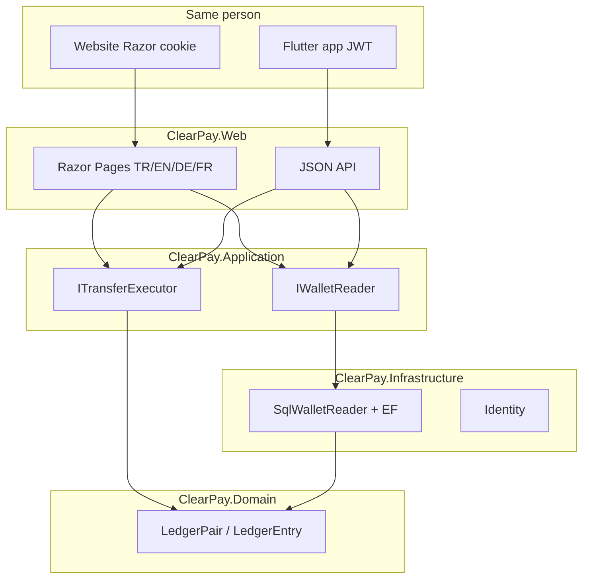
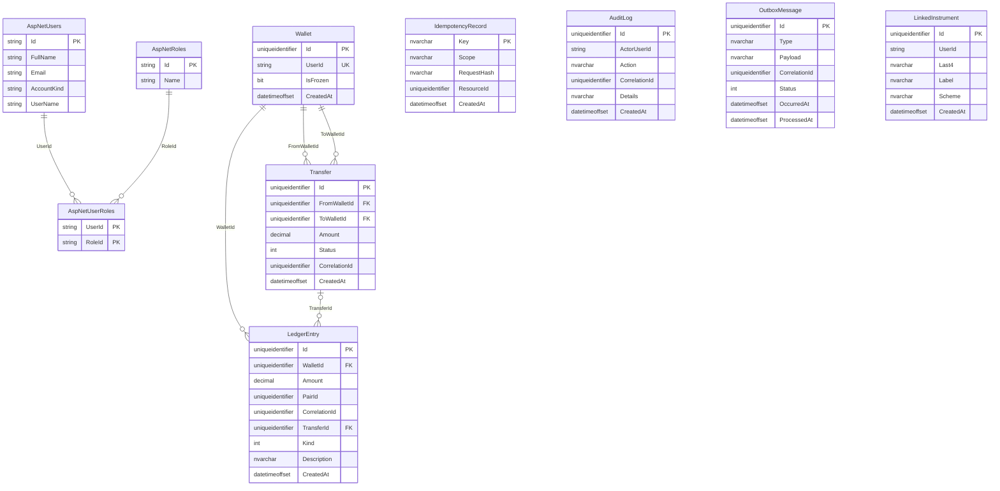

# ClearPay

| **English** | [Türkçe](./README.tr.md) | [Deutsch](./README.de.md) | [Français](./README.fr.md) |
|:-----------:|:-----------------------:|:------------------------:|:--------------------------:|

<p align="center">

<strong>English</strong> · [Türkçe](./README.tr.md) · [Deutsch](./README.de.md) · [Français](./README.fr.md)

</p>

<p align="center">
  
</p>

<p align="center">
  <a href="https://github.com/HalilMertDeveli/clearpay/actions/workflows/ci.yml"></a>
  
  
  
  
  <a href="LICENSE"></a>
</p>

<p align="center">
  
</p>

<p align="center">
  <b>Demo digital wallet</b> — ASP.NET Core 8 + Flutter, one SQL Server ledger, no <code>UPDATE Balance</code>.<br>
  Fake bank gateway. <b>Not</b> a licensed e-money institution. <b>Not</b> Papara / FAST / a retail bank clone.
</p>

I am **Halil Mert Develi**. This is the interview repo I defend (Intertech, Softtech): double-entry, idempotent HTTP, two clients, one cash register.

<p align="center">
  
</p>

---

## Website

Razor Pages at [http://localhost:5153](http://localhost:5153) (Development seed `admin@clearpay.test` / `Deneme123`). A Canada Central App Service hostname exists, but `/api/health` still returns **404** — live HTTPS is **TASK-16**, so these shots are **local**. Not a licensed bank UI.

| Sign-in `/giris` | Summary after login |
|:----------------:|:-------------------:|
|  |  |
| Language bar TR · EN · DE · FR. Demo wallet. | Same SQL ledger. Balance is `LedgerPair.NetOf`. |

| Register `/kayit` | Cards `/kartlar` |
|:-----------------:|:----------------:|
|  |  |
| Cookie Identity. Same four languages. | Last four + scheme only. No PAN in SQL. Fake gateway. |

---

## Mobile app

Flutter JWT client on Android emulator `emulator-5554` → `http://10.0.2.2:5153`. Same wallet screens as the website (including Kartlarım), same SQL. **Not** a Hive / Firestore cash register. Firestore may write `app_meta/ping` only.

<p align="center">
  
</p>

<p align="center"><i>Özet — language strip in chrome, demo footer. Wallet rows come from JWT → SQL (spinner while the local API answers).</i></p>

<p align="center">
  
</p>

---

## Why it exists

Most demo wallets store a number on `Wallet.Balance` and patch it. ClearPay does not.

| Rule | What the code does |
|------|-------------------|
| **Balance is derived** | `LedgerPair.NetOf` over signed `LedgerEntry` rows. There is no balance column. |
| **Replay is 409** | Same `Idempotency-Key` = same intent. A timeout retry must not debit twice. |
| **One SQL transaction** | Debit, credit, transfer, idempotency, audit, and outbox commit together. |
| **Outbox first** | The message row is in that transaction. Hangfire (and Rabbit when bound) publish after commit. |
| **Two clients, one ledger** | Website (cookie) and Flutter (JWT) hit the same Application ports. The phone has no Hive / SQLite / Firestore wallet. |

---

## Two clients

| | Website | Mobile app |
|--|---------|------------|
| Path | `src/ClearPay.Web` | [`mobile/clearpay`](mobile/clearpay) |
| UI | Razor Pages, TR / EN / DE / FR | Flutter 3.41, TR default, same four languages |
| Auth | ASP.NET Identity cookie | JWT Bearer (`POST /api/token`) |
| Money | Application ports → SQL | **Same ports.** No second cash register |
| Extra | [`/kartlar`](http://localhost:5153/kartlar) — demo linked cards (last four + scheme, no PAN) | Flutter **Kartlarım** — same last four + scheme; `GET/POST /api/cards`; PAN not in SQL |

Flutter **web is not a product**. The browser product is Razor. Android emulator uses `http://10.0.2.2:5153`; Windows / iOS use `http://localhost:5153`.

---

## Run it

.NET 8 SDK. Development uses **SQL Server LocalDB** `(localdb)\MSSQLLocalDB` / database `ClearPay` for Identity **and** the ledger.

```bash
dotnet run --project src/ClearPay.Web --launch-profile http
```

Open [http://localhost:5153/giris](http://localhost:5153/giris) — `admin@clearpay.test` / `Deneme123` (Development seed only).

```bat
cd /d D:\ClearPay\clearpay\mobile\clearpay
flutter run -d emulator-5554
```

```bash
dotnet test
dotnet build ClearPay.slnx
```

OpenAPI: [http://localhost:5153/swagger](http://localhost:5153/swagger) · health: [http://localhost:5153/api/health](http://localhost:5153/api/health)

Docker Desktop is optional (SQL 2022 + Redis + Rabbit). App money is **SQL Server only**. MySQL on this machine is a sidecar / Workbench tool — not the wallet. Do not commit `.env`. A Canada Central hostname exists; `/api/health` is still **404**. Live hosting is TASK-16 (`docs/CANLI.md`). This README does not treat that URL as a working product.

---

## What you can click

| | Website | Flutter |
|--|---------|---------|
| Sign in | [`/giris`](http://localhost:5153/giris) | Giriş — email or demo TC `10000000146` |
| Register | [`/kayit`](http://localhost:5153/kayit) | Hesap oluştur |
| Summary | [`/`](http://localhost:5153/) | Özet — `GET /api/wallet` |
| Transfer | [`/havale`](http://localhost:5153/havale) | Havale — `POST /api/transfers` + `Idempotency-Key` → **201 / 409** |
| Cards | [`/kartlar`](http://localhost:5153/kartlar) | Parked (same SQL instruments via API) |
| Top-up / withdraw | [`/yukle-cek`](http://localhost:5153/yukle-cek) | Yükle / Çek — fake gateway, including `TIMEOUT` |
| Movements | [`/hareketler`](http://localhost:5153/hareketler) | Hareketler |
| Receipt | [`/dekont/{id}`](http://localhost:5153/hareketler) | Dekont + PDF bytes from SQL |
| Admin | [`/admin`](http://localhost:5153/admin) | Admin tab (role) |

Language pickers are chrome (cookie `c=` on the site; local file on Flutter), not a tenth screen.

---

## Picture of the build

<p align="center">
  
</p>

Web never computes ledger math. The summary page asks `IWalletReader`. Today that adapter is `SqlWalletReader`: balance = `LedgerPair.NetOf`, this month in/out, last five rows, freeze badge. If SQL is down you still get the site — zeros, not a 500.

<p align="center">
  
</p>



| Layer | Project | Holds | Must not hold |
|-------|---------|-------|----------------|
| UI + host | `ClearPay.Web` | Razor, cookie, culture cookie, `:5153` | Ledger net, `UPDATE Balance` |
| Use cases | `ClearPay.Application` | Ports, DTOs, FluentValidation | Connection strings |
| Adapters | `ClearPay.Infrastructure` | EF SQL Server (Identity + ledger), gateway stubs | Razor / CSS |
| Rules | `ClearPay.Domain` | `LedgerPair`, `Wallet` (no balance field) | EF, HTTP, ASP.NET |

Dependencies point **inward**. Domain does not reference EF or ASP.NET.

---

## Relational schema (SQL Server)

**Demo — fake bank gateway.** Not licensed e-money. Identity and the ledger share one LocalDB database (two EF contexts, two history tables). `Wallet.UserId` matches `AspNetUsers.Id` with **no FK** (two DbContexts). Real FKs are Identity membership plus `LedgerEntry` → `Wallet` / `Transfer`.

`LinkedInstrument` stores **last four + scheme + label** only. PAN / CVV are never persisted.



`IdempotencyRecord.Key` is unique (replay → **409**). History tables: `__EFMigrationsHistory` (ledger) and `__EFMigrationsHistoryIdentity`.

---

## Firebase is not the cash register

Flutter initializes Firebase project `clearpay-c0485`. It may write **`app_meta/ping`** (`ok`, `client`, `message`, `touchedAt`) so the console can prove the client is alive.

Money does **not** go there. Balance, transfers, and receipts stay JWT → ASP.NET → SQL Server. Firestore rules deny every other path. Windows desktop skips native Firebase plugins; use the **Android emulator** to see the ping on the sign-in screen.

---

## Interview (three sentences)

1. Same `Idempotency-Key` is the same intent: the second HTTP is **409 Conflict** so a timeout retry does not debit twice.
2. Debit, credit, transfer row, idempotency, audit, and outbox commit in **one SQL transaction**; there is no `UPDATE Balance` — balance is `LedgerPair.NetOf`.
3. The outbox row is written in that same transaction so a timeout cannot lose the message; Hangfire (and Rabbit when bound) publish after commit.

---

## CV bullets (intended)

Copy these into LinkedIn / a résumé. Do not add Papara, FAST, licensed e-money, or “I shipped a payments company.”

- Built **ClearPay**, an ASP.NET Core 8 **wallet demo** with idempotent P2P transfers, JWT/cookie auth, and a double-entry ledger on SQL Server (`LedgerPair.NetOf`; no `UPDATE Balance`).
- Same `Idempotency-Key` returns **409 Conflict**; ledger + outbox commit in **one SQL transaction**. Mock BankGateway over REST and SOAP. Razor Pages + Flutter JWT share that ledger. SignalR refreshes the other client (not a second cash register).
- Shipped Docker Compose, xUnit tests, Serilog correlation, and GitHub Actions CI. Public Azure HTTPS is **TASK-16** (you add the publish-profile secret) — not a licensed e-money product.

Full CV pack (TR/EN HTML): `C:\Users\clt\Desktop\Halil_Mert_Develi_CV_Paket`. Repo copy: [`docs/CV-HALIL.md`](docs/CV-HALIL.md).

---

## Repo map

```
src/ClearPay.Domain           LedgerEntry, LedgerPair, Wallet (no Balance)
src/ClearPay.Application      IWalletReader, ITransferExecutor, IBankGateway
src/ClearPay.Infrastructure   SqlWalletReader, EF SQL Server, Identity
src/ClearPay.Web              Razor + localization + MapControllers
mobile/clearpay               Flutter JWT client (not in the .slnx)
tests/ClearPay.Tests          LedgerPair, 409, architecture, culture
infra/                        Bicep unused on the live site (T-104); you click Azure Portal
docker-compose.yml            SQL Server 2022 — not the web app
ClearPay.slnx
```

---

## Roadmap (honest)

| Done | Next |
|------|------|
| TASK-01…15 — screens, ledger, 409, gateway, outbox, Redis/Rabbit, tests, Swagger | **TASK-16** — App Service `ClearPay` exists; `/api/health` is still **404**. You add GitHub secret `AZURE_WEBAPP_PUBLISH_PROFILE` + Portal startup `dotnet ClearPay.Web.dll`. Do **not** run `.\infra\deploy.ps1` (it would replace the live site). |
| Flutter JWT app, Kartlarım (web + Flutter), Firestore ping (meta only) | Store listing / working public HTTPS still TASK-16 |

CI on `main` restores and runs `tests/ClearPay.Tests`.

---

## Docs

- [`docs/SPEC.md`](docs/SPEC.md) — screens and money rules
- [`docs/ARCHITECTURE.md`](docs/ARCHITECTURE.md) — onion layers
- [`docs/CANLI.md`](docs/CANLI.md) — Azure click list (no secrets in git)
- [`docs/YOL.md`](docs/YOL.md) — career path; live URL is TASK-16
- [`docs/FARK.md`](docs/FARK.md) — reconciliation-first, not a Papara rival
- [`mobile/clearpay/README.md`](mobile/clearpay/README.md) — Flutter client
- [`docs/API-ESZAMAN.md`](docs/API-ESZAMAN.md) — SignalR hub (not the ledger)

## License

[MIT](LICENSE) © 2026 Halil Mert Develi
