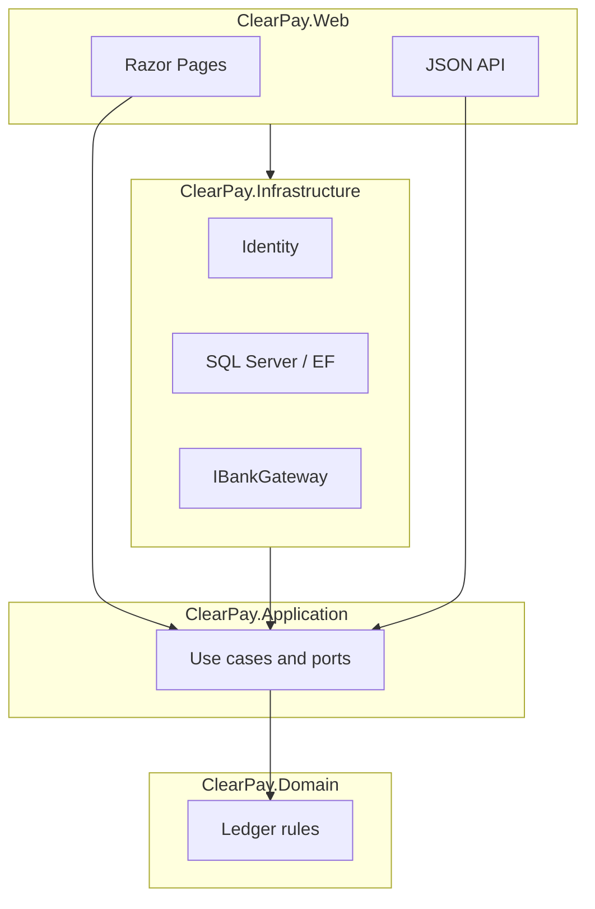

# ClearPay

**English** | [Türkçe](README.tr.md) | [Français](README.fr.md)

[](https://dotnet.microsoft.com/download/dotnet/8.0)
[](https://learn.microsoft.com/dotnet/csharp/)
[](LICENSE)
[](#status)

ASP.NET Core 8 demo wallet: idempotent P2P transfers, a double-entry ledger on SQL Server, and a mock bank gateway (REST + SOAP) with an outbox so an HTTP timeout cannot drop a payment.

> **Demo — not a real bank.** No live POS, FAST, card acquiring, or e-money licence. ClearPay is **not** a Papara (or Tosla / Paycell / ininal) competitor. The UI is Turkish. Screenshots will be added when the eight screens are stable; none are faked here.

## Table of contents

- [Product](#product)
- [Eight screens](#eight-screens)
- [Architecture](#architecture)
- [Stack](#stack)
- [Why 409, transactions, and the outbox](#why-409-transactions-and-the-outbox)
- [Run locally](#run-locally)
- [Repository layout](#repository-layout)
- [Status](#status)
- [Docs](#docs)
- [License](#license)

## Product

Registered users see a TL balance, send money to another user, top up or withdraw through a **mock** bank, and open history plus a receipt. An admin can freeze a wallet and search the audit trail.

The interview story this repo is built to prove: every kuruş has a `+` and a `−` line on **your** ledger, the same `Idempotency-Key` never debits twice, and a timeout does not erase the intent. Balance is never “fixed” with a silent `UPDATE`.

## Eight screens

Fixed product list ([`docs/SPEC.md`](docs/SPEC.md)). No merchant panel, no real POS.

| # | Screen | What you see |
|---|--------|----------------|
| 1 | Login | Email, password, link to create an account |
| 2 | Register | Name, email, password, confirm |
| 3 | Wallet summary | Balance, this month in/out, last 5 movements |
| 4 | Transfer (Havale) | Recipient, amount, description, remaining balance |
| 5 | Top up / withdraw | Mock bank, amount, IBAN-like field; success or timeout |
| 6 | Movements | Date, id, type, counterparty, amount, status; filter + page |
| 7 | Receipt (Dekont) | Parties, amount, correlation id, time |
| 8 | Admin | Freeze user, failed queue, audit search |

Left nav (same on every page): **Özet**, **Havale**, **Yükle/Çek**, **Hareketler**. **Admin** is role-only (hidden until TASK-10).

## Architecture

One ASP.NET Core 8 host (Razor Pages + JSON API). Clean Architecture, four projects. Domain does not depend on HTTP or EF.



| Project | Holds | Does not hold |
|---------|--------|----------------|
| `ClearPay.Domain` | Roles, money rules, `LedgerEntry` meaning | HTTP, EF, Razor |
| `ClearPay.Application` | Use cases, DTOs, FluentValidation, ports | Connection strings, cookies |
| `ClearPay.Infrastructure` | Identity, SQL, EF/Dapper, Hangfire, bank gateway | Razor, CSS |
| `ClearPay.Web` | Pages + JSON API, cookie/JWT host | Ledger math, balance “fixes” |

Dependencies: Web → Application + Infrastructure; Infrastructure → Application → Domain.

## Stack

| Layer | Now | Planned |
|-------|-----|---------|
| Language / runtime | C# 12, **.NET 8** | — |
| Web | ASP.NET Core: Razor Pages + Web API, one host | JWT + OpenAPI/Swagger (TASK-06 / TASK-14) |
| Data | Docker **SQL Server** (Compose); Identity **SQLite** (`App_Data`) | EF Core on SQL Server for the ledger (TASK-04); Dapper / T-SQL for lists |
| Identity | ASP.NET Identity **cookie** (site) | **JWT** for `POST /api/transfers` |
| Validation / tests | FluentValidation, **xUnit**, FluentAssertions, WebApplicationFactory | Hardened 409 + ledger invariant tests (TASK-13) |
| Ops | Docker Compose (SQL only) | Hangfire + outbox worker (TASK-11); Redis + RabbitMQ (TASK-12) |
| CI / live | — | GitHub Actions (TASK-15); **Azure App Service** Linux + Azure SQL, West Europe (TASK-16) |

Serilog correlation, Hangfire, Redis, and RabbitMQ are in the plan, not yet package references. The build badge above is a **placeholder** until TASK-15 adds Actions.

## Why 409, transactions, and the outbox

| Why | What the code is meant to do |
|-----|------------------------------|
| **409 Conflict** | The same `Idempotency-Key` is the same intent. A second `201` would debit twice. Replay returns **409**; no second cut. |
| **One SQL transaction** | Debit, credit, transfer row, idempotency, audit, and outbox insert commit together or not at all. |
| **Outbox** | The ledger write is the source of truth. The message is published **after** commit so an HTTP timeout cannot lose it. |

HTTP 409 is **TASK-06**. The outbox worker is **TASK-11**. Domain rules for double-entry already live under `ClearPay.Domain/Ledger`. There is no `UPDATE Balance` helper.

## Run locally

**Need:** [.NET 8 SDK](https://dotnet.microsoft.com/download/dotnet/8.0). Docker is required for SQL Server; login/register can run without it (Identity uses SQLite until TASK-04).

```bash
docker compose up -d
dotnet run --project src/ClearPay.Web --launch-profile http
```

Open [http://localhost:5153](http://localhost:5153) — login `/Account/Login`, register `/Account/Register`, then the empty wallet summary (`0,00 ₺`).

```bash
dotnet test
dotnet build ClearPay.slnx
```

SQL listens on `localhost,1433`. The web app does **not** read SQL Server yet (TASK-04). Default local SA password is in `.env.example` (`ClearPay_Dev1!`) — Docker only; never use it on Azure. Do not commit `.env`.

## Repository layout

```
clearpay/
├── src/
│   ├── ClearPay.Domain/          # money rules, roles
│   ├── ClearPay.Application/     # use cases, ports, validators
│   ├── ClearPay.Infrastructure/  # Identity, persistence, gateways
│   └── ClearPay.Web/             # Razor + API host (:5153)
├── tests/
│   └── ClearPay.Tests/           # xUnit
├── docs/                         # SPEC, PLAN, architecture, desks
├── docker-compose.yml            # SQL Server 2022
└── ClearPay.slnx
```

## Status

| Done | Next |
|------|------|
| TASK-01 docs + agent roles | **TASK-04** SQL model + ledger skeleton |
| TASK-02 solution, layout, Compose SQL | TASK-05 live wallet summary |
| TASK-03 login, register, empty summary | TASK-06 havale + **409** |

Cookie Identity is in the tree (SQLite). JWT, ledger-on-SQL, mock bank HTTP, Hangfire, CI, and a public Azure URL are **not** shipped. Queue: [`docs/TASKS.md`](docs/TASKS.md). Live plan (no publish until you open Azure): [`docs/CANLI.md`](docs/CANLI.md).

**CV lines (target, not a claim that every line is already proven in HTTP):**

- Built ClearPay, an ASP.NET Core 8 wallet with idempotent P2P transfers, JWT/cookie auth, and a double-entry ledger on SQL Server.
- Integrated a mock bank gateway over REST and SOAP; used an outbox + queue so payment completion is not lost on timeout.
- Shipped Docker Compose, xUnit tests, Serilog correlation, and CI/CD to Azure App Service.

Until TASK-06 / TASK-11 / TASK-16 land, say the **rules are locked** and the HTTP proof is still on the queue.

## Docs

| Doc | What it is |
|-----|------------|
| [SPEC](docs/SPEC.md) | Product, eight screens, money rules |
| [PLAN](docs/PLAN.md) | Phased work; one TASK at a time |
| [ARCHITECTURE](docs/ARCHITECTURE.md) | Layers, routes, cookie then JWT |
| [TASKS](docs/TASKS.md) | Todo / Doing / Done |
| [CANLI](docs/CANLI.md) | Q1 Azure App Service + Azure SQL (you open the account) |
| [DEPLOY](docs/DEPLOY.md) | Local Compose + `dotnet run` |
| [FARK](docs/FARK.md) | Reconciliation-first ledger; not a Papara rival |
| [URUN](docs/URUN.md) | Who sees what; acceptance |
| [KRONIK](docs/KRONIK.md) | Learning chronicle (Turkish) |
| [İK](docs/IK.md) | Candidate CV / interview script (not hiring) |
| [FINANS](docs/FINANS.md) | Double-entry, correlation id |
| [TARTISMA](docs/TARTISMA.md) | Discuss-then-act log |
| [AGENTS](docs/AGENTS.md) | Orchestrator, Coder, Payments, … |
| [Çalışma planı](docs/CALISMA-PLANI.md) | Agent sequence + test gates |
| [Yönetici raporu](docs/YONETICI-RAPORU.md) | Status / RAG |
| [Öğrenme](docs/OGRENME.md) | Why it is built this way |
| [Senin işlerin](docs/SENIN-ISLERIN.md) | Human-only checklist |
| [Ödeme (senin)](docs/ODEME-SENIN.md) | Demo money: what you do / don’t |
| [SATIS](docs/SATIS.md) | Interview pitch |
| [PR](docs/PR.md) | Honest ranking (not #1 vs Papara) |
| [PAZARLAMA](docs/PAZARLAMA.md) | GitHub / LinkedIn / demo URL |
| [DESTEK](docs/DESTEK.md) | Demo FAQ (not a bank helpdesk) |
| [SEO](docs/SEO.md) / [ADS](docs/ADS.md) | Meta / ads drafts after a live URL |

## License

[MIT](LICENSE). Contributions should follow [`docs/SPEC.md`](docs/SPEC.md) (screen list is fixed) and [`docs/TARTISMA.md`](docs/TARTISMA.md) before changing `src/`.
