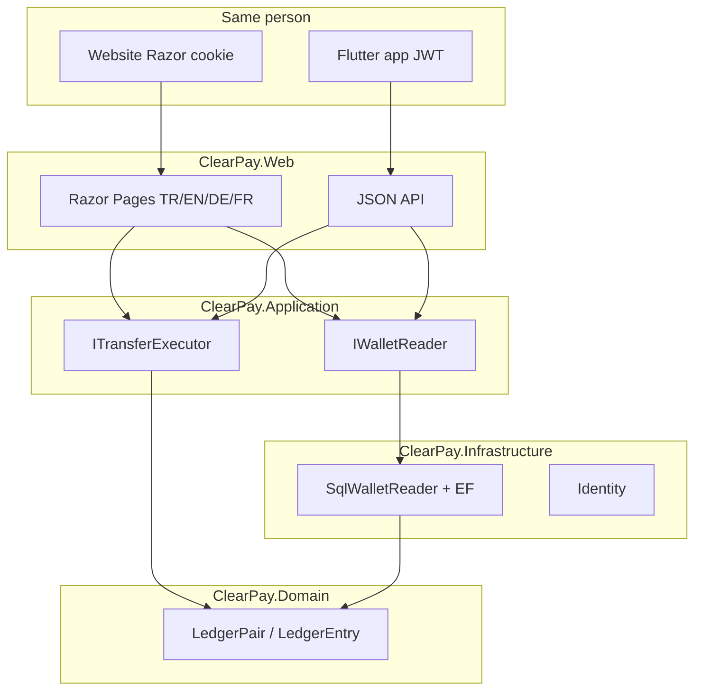
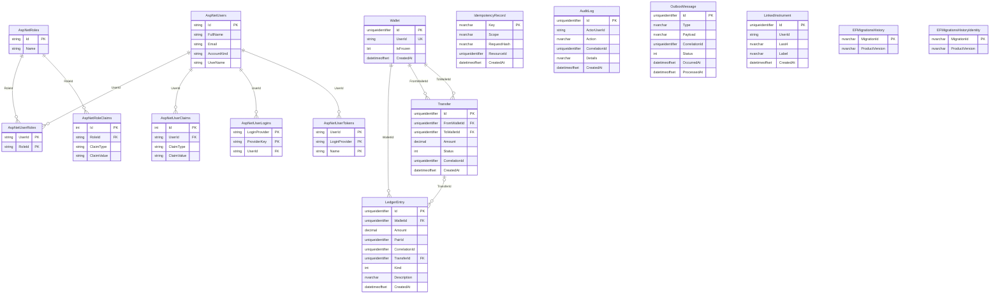

# ClearPay

<p align="center">
  <b>English</b>
  · <a href="README.tr.md">Türkçe</a>
  · <a href="README.de.md">Deutsch</a>
  · <a href="README.fr.md">Français</a>
</p>

<p align="center">
  <a href="https://github.com/HalilMertDeveli/clearpay/actions/workflows/ci.yml"></a>
  
  
  
  
  <a href="LICENSE"></a>
</p>

<p align="center"><b>Demo — fake gateway for top-ups.</b> Not a licensed e-money institution. Not Papara / FAST / a fake retail bank.</p>

**One wallet, two clients.** The same person signs in, sends money, tops up, and opens a receipt on the **website** and in the **Flutter app**. One SQL ledger. The phone does not keep a second balance.

ASP.NET Core 8 **WePay-like wallet website** plus a **Flutter** JWT client ([`mobile/clearpay`](mobile/clearpay)). Razor Pages for the browser (cookie); JSON for the app (JWT). Double-entry lives in Domain — `Wallet` has **no** `Balance` column.

I am Halil Mert Develi. I wrote this as the .NET interview repo I actually want to defend (Intertech, Softtech, that kind of shop). MIT licence.

---

## Picture of the build


Web never computes ledger math. The özet (summary) page asks `IWalletReader`. Today that adapter is `SqlWalletReader`: balance = `LedgerPair.NetOf`, this month in/out, last five rows, freeze badge. If SQL Server is down you still get the site — zeros, not a 500.




| Layer | Project | Holds | Must not hold |
|-------|---------|-------|----------------|
| UI + host | `ClearPay.Web` | Razor, cookie, culture cookie, `:5153` | Ledger net, `UPDATE Balance` |
| Use cases | `ClearPay.Application` | Ports, DTOs, FluentValidation | Connection strings |
| Adapters | `ClearPay.Infrastructure` | EF SQL Server (Identity + ledger, same LocalDB), gateway stubs | Razor / CSS |
| Rules | `ClearPay.Domain` | `LedgerPair`, `Wallet` (no balance field) | EF, HTTP, ASP.NET |

Dependencies point **inward**. Domain does not reference EF or ASP.NET.

---

## Relational schema (SQL Server)

**Demo — sahte banka gateway. Lisanslı e-para değil.** Not Papara / FAST / a fake retail bank. Eight screens, not a ninth.

Local Development: `(localdb)\MSSQLLocalDB` / database `ClearPay`. Identity and the ledger share that one database (two EF contexts, two history tables). **Two clients, one SQL ledger:** Razor Pages (cookie) and Flutter (JWT). Flutter `firebase_core` is client bootstrap for project `clearpay-c0485` — not a Firestore wallet. MySQL (`ConnectionStrings:MySql`) is a sidecar / Workbench tool; money does not live there.

There is **no** `Wallet.Balance` column. Balance = `LedgerPair.NetOf` over signed `LedgerEntry` rows (`LedgerPair` is C#, not a table). `UPDATE Balance` is forbidden. `Wallet.UserId` is unique and matches `AspNetUsers.Id` in the same database; there is **no FK** (two DbContexts). Real FKs are Identity membership plus `LedgerEntry` → `Wallet` / `Transfer`, and `Transfer` → `Wallet` (from/to).



EF history table names: `__EFMigrationsHistory` (ledger) and `__EFMigrationsHistoryIdentity` (Identity). `IdempotencyRecord.Key` is unique (replay → **409**). `LinkedInstrument` stores last-four only — no PAN.

---

## What you can click today

Same eight operations on the site and in the app. Site language: **Türkçe (default), English, Deutsch, Français**. Flutter UI default is Türkçe. Not a 9th screen.

| Operation | Website | Flutter app |
|-----------|---------|-------------|
| Sign in | [`/giris`](http://localhost:5153/giris) | Giriş — `POST /api/token` |
| Register | [`/kayit`](http://localhost:5153/kayit) | Hesap oluştur — `POST /api/register` |
| Summary | [`/`](http://localhost:5153/) | Özet, live hub + pull-to-refresh — `GET /api/wallet` |
| Transfer | [`/havale`](http://localhost:5153/havale) | Havale + confirm — `POST /api/transfers` + `Idempotency-Key` |
| Top-up / withdraw | [`/yukle-cek`](http://localhost:5153/yukle-cek) | Yükle / Çek — `POST /api/topup` / `withdraw` |
| Movements | [`/hareketler`](http://localhost:5153/hareketler) | Hareketler + filter — `GET /api/movements` |
| Receipt | [`/dekont/{id}`](http://localhost:5153/hareketler) | Dekont — `GET /api/receipts/{id}` |
| Admin | [`/admin`](http://localhost:5153/admin) | Admin tab (role Admin) — `/api/admin/*` |

Dev seed: `admin@clearpay.test` / `Deneme123`. Transfer **201** / replay **409**. OpenAPI: [http://localhost:5153/swagger](http://localhost:5153/swagger). Mobile README: [`mobile/clearpay/README.md`](mobile/clearpay/README.md). `GET /api/health` → `{ "status": "ok", "product": "ClearPay", "redis": "up|down|off", "rabbit": "up|down|off" }`.

Redis caches the wallet summary DTO only (~60s; bust on money movement). Ledger stays SQL Server. Rabbit publishes outbox to `clearpay.outbox` when `ConnectionStrings:RabbitMq` is set; otherwise Hangfire + log. **No public Azure URL yet** — you click `az login` (see `docs/CANLI.md`).

## Interview (three sentences)

1. Same `Idempotency-Key` is the same intent: the second HTTP is **409 Conflict** so a timeout retry does not debit twice.
2. Debit, credit, transfer row, idempotency, audit, and outbox commit in **one SQL transaction**; there is no `UPDATE Balance` — balance is `LedgerPair.NetOf`.
3. The outbox row is written in that same transaction so a timeout cannot lose the message; Hangfire (and Rabbit when bound) publish after commit.

---

## Run

.NET 8 SDK. **Web Development** uses SQL Server LocalDB — `(localdb)\MSSQLLocalDB` / `ClearPay` — for both Identity and the ledger. Docker Desktop is optional (SQL Server 2022 + Redis/Rabbit).

```bash
dotnet run --project src/ClearPay.Web --launch-profile http
```

Open [http://localhost:5153](http://localhost:5153). Then the same money in Flutter (**cmd**):

```bat
cd /d mobile\clearpay
flutter doctor
flutter run -d windows
```

Android emulator uses `http://10.0.2.2:5153`. Flutter talks JWT to the same host; `firebase_core` (`clearpay-c0485`) does not store balance. Without LocalDB/SQL the summary stays `0,00 ₺`.

```bash
dotnet test
dotnet build ClearPay.slnx
```

Optional Docker SQL bind is `D:\ClearPay\data\mssql` (this machine). Local SA password is in `.env.example` (Compose only). Do not commit `.env`. Do not put that password on Azure.

App ledger is **SQL Server only**. MySQL (`ConnectionStrings:MySql`, Windows `MySQL84` or Compose) is a sidecar — not the wallet database. Mobile is **JWT → C# → SQL Server** — no MySQL driver and no Firestore wallet in Flutter.

---

## Repo map

```
src/ClearPay.Domain           LedgerEntry, LedgerPair, Wallet (no Balance)
src/ClearPay.Application      IWalletReader, ITransferExecutor, IBankGateway
src/ClearPay.Infrastructure   SqlWalletReader, EF SQL Server, Identity (same LocalDB)
src/ClearPay.Web              Razor + localization + MapControllers
mobile/clearpay               Flutter JWT client (not in the .slnx)
tests/ClearPay.Tests          LedgerPair, architecture, SqlWalletReader, culture
docker-compose.yml            SQL Server 2022 — not the web app
ClearPay.slnx
```

---

## Roadmap (honest)

| Done | Next |
|------|------|
| TASK-01…15 — screens, ledger, 409, gateway, outbox, Redis/Rabbit, tests, Swagger | **TASK-16** — Azure App Service + Azure SQL (you click `az login`; no live URL invented here) |

CI restores and tests `tests/ClearPay.Tests` on `main`.

---

## Docs

- [`docs/YOL.md`](docs/YOL.md) — what it is for, where it goes (career first; live URL is TASK-16)
- [`docs/SPEC.md`](docs/SPEC.md) — screens and money rules (409, one transaction, outbox)
- [`docs/ARCHITECTURE.md`](docs/ARCHITECTURE.md) — onion layers, cookie then JWT
- [`docs/FARK.md`](docs/FARK.md) — reconciliation-first; not a Papara rival
- [`docs/SATIS.md`](docs/SATIS.md) — 15-second pitch
- [`docs/DEPLOY.md`](docs/DEPLOY.md) — Compose + `dotnet run`
- [`mobile/clearpay/README.md`](mobile/clearpay/README.md) — Flutter client (same eight operations)
- Step-by-step: [`docs/OTURUM-PLAN.md`](docs/OTURUM-PLAN.md) (public in this repo). Same list in [Notion](https://www.notion.so/3bb31a8b18e4816bb34ffa405b4dec5d) — on that page, Share → Publish to web so people without a Notion login can open it.
- [`docs/ESZAMANLI.md`](docs/ESZAMANLI.md) — concurrent work (git / desks / this machine)
- [`docs/API-ESZAMAN.md`](docs/API-ESZAMAN.md) — live wallet hub (Halil API steps; SignalR ≠ ledger)

Live target: Azure App Service + Azure SQL (West Europe). There is no `azurewebsites.net` to click today.

## License

[MIT](LICENSE) © 2026 Halil Mert Develi
