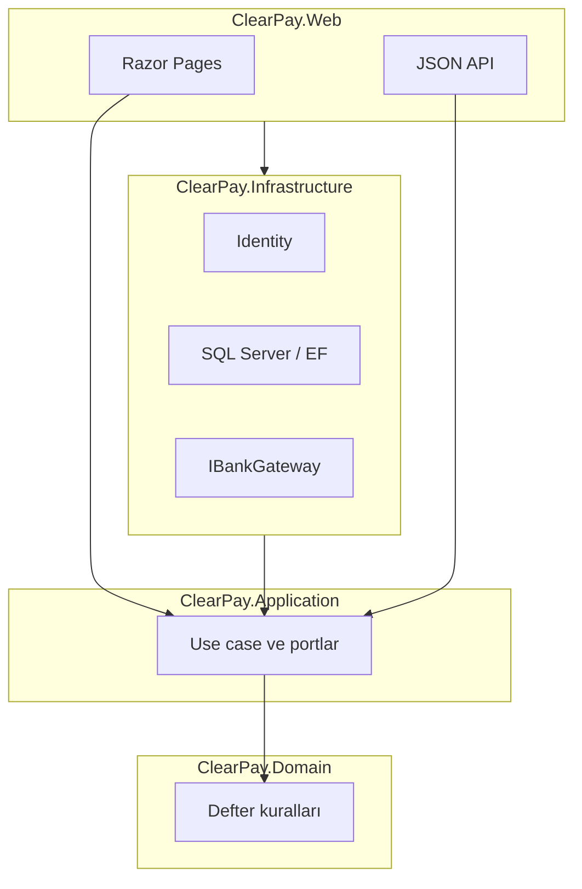

# ClearPay

[English](README.md) | **Türkçe** | [Français](README.fr.md)

[](https://dotnet.microsoft.com/download/dotnet/8.0)
[](https://learn.microsoft.com/dotnet/csharp/)
[](LICENSE)
[](#durum)

ASP.NET Core 8 demo cüzdan: idempotent P2P havale, SQL Server üzerinde çift kayıt defteri, sahte banka gateway (REST + SOAP) ve HTTP timeout’ta ödemenin kaybolmaması için outbox.

> **Demo — gerçek banka değil.** Canlı POS, FAST, kart tahsilatı veya e-para lisansı yok. ClearPay **Papara** (veya Tosla / Paycell / ininal) rakibi **değil**. Arayüz Türkçe. Ekran görüntüleri sekiz ekran oturunca eklenecek; burada sahte görsel yok.

## İçindekiler

- [Ürün](#ürün)
- [Sekiz ekran](#sekiz-ekran)
- [Mimari](#mimari)
- [Yığın](#yığın)
- [Neden 409, transaction ve outbox](#neden-409-transaction-ve-outbox)
- [Lokal çalıştırma](#lokal-çalıştırma)
- [Repo düzeni](#repo-düzeni)
- [Durum](#durum)
- [Belgeler](#belgeler)
- [Lisans](#lisans)

## Ürün

Kayıtlı kullanıcı TL bakiyesini görür, başka kullanıcıya havale eder, **sahte** bankadan yükler/çeker, geçmişi ve dekontu açar. Admin cüzdanı dondurur ve audit arar.

Bu reponun mülakat hikâyesi: her kuruşun sizin defterinizde `+` ve `−` satırı vardır; aynı `Idempotency-Key` ikinci kez kesmez; timeout niyeti silmez. Bakiye sessiz `UPDATE` ile “düzeltilmez”.

## Sekiz ekran

Sabit ürün listesi ([`docs/SPEC.md`](docs/SPEC.md)). Satıcı paneli yok, gerçek POS yok.

| # | Ekran | Ne görünür |
|---|--------|------------|
| 1 | Giriş | E-posta, şifre, hesap oluştur linki |
| 2 | Kayıt | Ad, e-posta, şifre, şifre tekrar |
| 3 | Cüzdan özeti | Bakiye, bu ay giden/gelen, son 5 hareket |
| 4 | Havale | Alıcı, tutar, açıklama, kalan bakiye |
| 5 | Yükle / çek | Sahte banka, tutar, IBAN benzeri; başarı veya timeout |
| 6 | Hareketler | Tarih, işlem no, tür, karşı taraf, tutar, durum; filtre + sayfa |
| 7 | Dekont | Taraflar, tutar, correlation id, zaman |
| 8 | Admin | Kullanıcı dondur, başarısız kuyruk, audit ara |

Sol menü her sayfada aynı: **Özet**, **Havale**, **Yükle/Çek**, **Hareketler**. **Admin** yalnızca rolde (TASK-10’a kadar gizli).

## Mimari

Tek ASP.NET Core 8 host (Razor Pages + JSON API). Clean Architecture, dört proje. Domain HTTP veya EF’e bakmaz.



| Proje | Ne tutar | Ne tutmaz |
|-------|----------|-----------|
| `ClearPay.Domain` | Roller, para kuralları, `LedgerEntry` anlamı | HTTP, EF, Razor |
| `ClearPay.Application` | Use case, DTO, FluentValidation, portlar | Connection string, cookie |
| `ClearPay.Infrastructure` | Identity, SQL, EF/Dapper, Hangfire, banka gateway | Razor, CSS |
| `ClearPay.Web` | Sayfalar + JSON API, cookie/JWT host | Ledger hesabı, bakiye “düzeltme” |

Bağımlılık: Web → Application + Infrastructure; Infrastructure → Application → Domain.

## Yığın

| Katman | Şimdi | Plan |
|--------|--------|------|
| Dil / runtime | C# 12, **.NET 8** | — |
| Web | ASP.NET Core: Razor Pages + Web API, tek host | JWT + OpenAPI/Swagger (TASK-06 / TASK-14) |
| Veri | Docker **SQL Server** (Compose); Identity **SQLite** (`App_Data`) | Ledger için SQL Server üzerinde EF Core (TASK-04); listeler için Dapper / T-SQL |
| Kimlik | ASP.NET Identity **cookie** (site) | JSON API için **JWT** (`POST /api/transfers`) |
| Doğrulama / test | FluentValidation, **xUnit**, FluentAssertions, WebApplicationFactory | 409 + bakiye invarianti sertleştirme (TASK-13) |
| Ops | Docker Compose (yalnız SQL) | Hangfire + outbox worker (TASK-11); Redis + RabbitMQ (TASK-12) |
| CI / canlı | — | GitHub Actions (TASK-15); **Azure App Service** Linux + Azure SQL, West Europe (TASK-16) |

Serilog correlation, Hangfire, Redis ve RabbitMQ planda; henüz paket referansı değil. Üstteki build rozeti **placeholder**; Actions TASK-15.

## Neden 409, transaction ve outbox

| Neden | Kodun yapması gereken |
|-------|------------------------|
| **409 Conflict** | Aynı `Idempotency-Key` aynı niyet. İkinci `201` çift kesinti olur. Tekrar **409**; ikinci kesinti yok. |
| **Tek SQL transaction** | Debit, credit, transfer satırı, idempotency, audit ve outbox insert birlikte commit olur veya hiç olmaz. |
| **Outbox** | Gerçeklik kaynağı ledger yazısıdır. Mesaj **commit’ten sonra** yayınlanır; HTTP timeout kaybettirmez. |

HTTP 409 **TASK-06**. Outbox worker **TASK-11**. Çift kayıt kuralları `ClearPay.Domain/Ledger` altında. `UPDATE Balance` yardımcısı yok.

## Lokal çalıştırma

**Gerekli:** [.NET 8 SDK](https://dotnet.microsoft.com/download/dotnet/8.0). SQL Server için Docker. Giriş/kayıt Docker olmadan da açılır (TASK-04’e kadar Identity SQLite).

```bash
docker compose up -d
dotnet run --project src/ClearPay.Web --launch-profile http
```

Aç: [http://localhost:5153](http://localhost:5153) — giriş `/Account/Login`, kayıt `/Account/Register`, sonra boş cüzdan özeti (`0,00 ₺`).

```bash
dotnet test
dotnet build ClearPay.slnx
```

SQL: `localhost,1433`. Uygulama henüz SQL Server’a **bağlanmaz** (TASK-04). Lokal SA şifresi `.env.example` içinde (`ClearPay_Dev1!`) — yalnızca Docker; Azure’da kullanma. `.env` commit edilmez.

## Repo düzeni

```
clearpay/
├── src/
│   ├── ClearPay.Domain/          # para kuralları, roller
│   ├── ClearPay.Application/     # use case, port, validator
│   ├── ClearPay.Infrastructure/  # Identity, kalıcılık, gateway
│   └── ClearPay.Web/             # Razor + API host (:5153)
├── tests/
│   └── ClearPay.Tests/           # xUnit
├── docs/                         # SPEC, PLAN, mimari, masalar
├── docker-compose.yml            # SQL Server 2022
└── ClearPay.slnx
```

## Durum

| Bitti | Sıradaki |
|-------|----------|
| TASK-01 docs + ajan rolleri | **TASK-04** SQL model + ledger iskeleti |
| TASK-02 solution, layout, Compose SQL | TASK-05 canlı cüzdan özeti |
| TASK-03 giriş, kayıt, boş özet | TASK-06 havale + **409** |

Cookie Identity repoda (SQLite). JWT, ledger-on-SQL, sahte banka HTTP, Hangfire, CI ve açık Azure URL **yok**. Kuyruk: [`docs/TASKS.md`](docs/TASKS.md). Canlı plan (Azure’u siz açmadan publish yok): [`docs/CANLI.md`](docs/CANLI.md).

**CV maddeleri (hedef; her satırın HTTP’de kanıtlandığı iddiası değil):**

- Built ClearPay, an ASP.NET Core 8 wallet with idempotent P2P transfers, JWT/cookie auth, and a double-entry ledger on SQL Server.
- Integrated a mock bank gateway over REST and SOAP; used an outbox + queue so payment completion is not lost on timeout.
- Shipped Docker Compose, xUnit tests, Serilog correlation, and CI/CD to Azure App Service.

TASK-06 / TASK-11 / TASK-16 gelene kadar: **kural kilitli**, HTTP kanıtı kuyrukta.

## Belgeler

| Belge | Ne |
|-------|-----|
| [SPEC](docs/SPEC.md) | Ürün, sekiz ekran, para kuralları |
| [PLAN](docs/PLAN.md) | Fazlı iş; tek seferde tek TASK |
| [ARCHITECTURE](docs/ARCHITECTURE.md) | Katmanlar, rotalar, önce cookie sonra JWT |
| [TASKS](docs/TASKS.md) | Todo / Doing / Done |
| [CANLI](docs/CANLI.md) | Q1 Azure App Service + Azure SQL (hesabı siz açarsınız) |
| [DEPLOY](docs/DEPLOY.md) | Lokal Compose + `dotnet run` |
| [FARK](docs/FARK.md) | Mutabakat-öncelikli defter; Papara rakibi değil |
| [URUN](docs/URUN.md) | Kim ne görür; kabul |
| [KRONIK](docs/KRONIK.md) | Öğrenme kroniği |
| [İK](docs/IK.md) | Aday CV / mülakat scripti (işe alım yok) |
| [FINANS](docs/FINANS.md) | Çift kayıt, correlation id |
| [TARTISMA](docs/TARTISMA.md) | Önce konuş, sonra yaz |
| [AGENTS](docs/AGENTS.md) | Orchestrator, Coder, Payments, … |
| [Çalışma planı](docs/CALISMA-PLANI.md) | Ajan sırası + test kapıları |
| [Yönetici raporu](docs/YONETICI-RAPORU.md) | Durum / RAG |
| [Öğrenme](docs/OGRENME.md) | Neden böyle |
| [Senin işlerin](docs/SENIN-ISLERIN.md) | Yalnız insan checklist’i |
| [Ödeme (senin)](docs/ODEME-SENIN.md) | Demo para: ne yaparsın / yapmazsın |
| [SATIS](docs/SATIS.md) | Mülakat pitch |
| [PR](docs/PR.md) | Dürüst sıra (Papara’ya karşı #1 yok) |
| [PAZARLAMA](docs/PAZARLAMA.md) | GitHub / LinkedIn / demo URL |
| [DESTEK](docs/DESTEK.md) | Demo SSS (banka yardım masası değil) |
| [SEO](docs/SEO.md) / [ADS](docs/ADS.md) | Meta / ads taslağı (canlı URL sonrası) |

## Lisans

[MIT](LICENSE). Katkı [`docs/SPEC.md`](docs/SPEC.md) ekran listesine ve `src/` değişmeden önce [`docs/TARTISMA.md`](docs/TARTISMA.md) protokolüne uyar.
