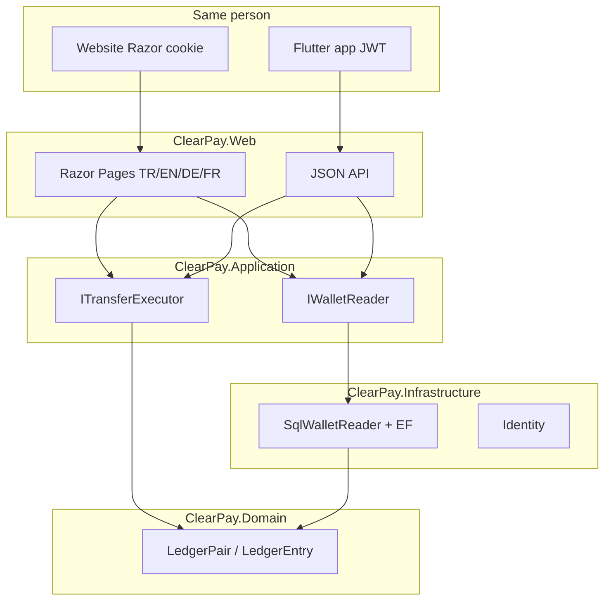
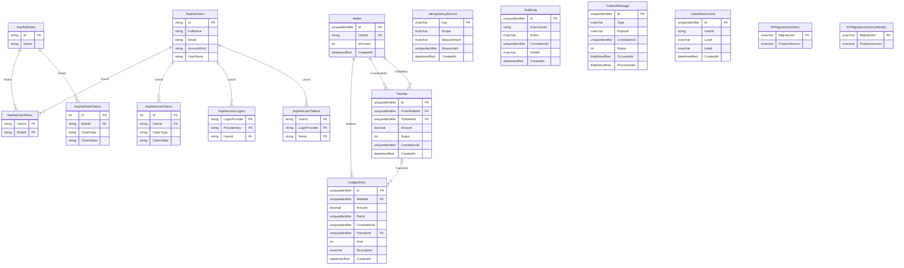

# ClearPay

<p align="center">
  <a href="README.md">English</a>
  · <b>Türkçe</b>
  · <a href="README.de.md">Deutsch</a>
  · <a href="README.fr.md">Français</a>
</p>

<p align="center">
  <a href="https://github.com/HalilMertDeveli/clearpay/actions/workflows/ci.yml"></a>
  
  
  
  
  
  <a href="LICENSE"></a>
</p>

<p align="center"><b>Demo — yükleme için sahte gateway.</b> Lisanslı e-para kuruluşu değil. Papara / FAST / sahte perakende banka değil.</p>

## Web + mobil (geldi)

Bu repo **yalnız site değil**. **Flutter mobil uygulaması** [`mobile/clearpay`](mobile/clearpay) klasöründe; aynı ASP.NET Core 8 host’a bağlanır.

| İstemci | Yığın | Kimlik | Para |
|---------|--------|--------|------|
| **Site** | Razor Pages, `src/ClearPay.Web` | Identity cookie | Application port → SQL defter |
| **Mobil uygulama** | Flutter 3.41, Android / Windows / iOS ağacı | JWT Bearer | Aynı portlar. Hive / Firestore / MySQL kasa **yok** |

Aynı sekiz işlem (giriş, kayıt, özet, havale, yükle/çek, hareketler, dekont, admin). Aynı `Idempotency-Key` → **409**. Telefonda **ikinci bakiye yok**. Flutter **web ürün yüzeyi değil** — tarayıcı ürünü Razor.

Uygulamayı çalıştırma (önce site `:5153`): aşağıdaki [**Mobil uygulama**](#mobil-uygulama-flutter) ve [`mobile/clearpay/README.md`](mobile/clearpay/README.md).

Ben Halil Mert Develi. Mülakat reposu (Intertech, Softtech): ledger + 409 **iki istemcide**. Lisans MIT.

---

## Mobil uygulama (Flutter)

**Bu repoda geldi** — maket değil, ikinci kasa değil.

- Klasör: [`mobile/clearpay`](mobile/clearpay) (aynı git; `ClearPay.slnx` içinde **yok**)
- Workspace: [`ClearPay.code-workspace`](ClearPay.code-workspace) → **ClearPay** + **ClearPay Flutter**
- Platform: Android emülatör (`http://10.0.2.2:5153`), Windows masaüstü, iOS proje ağacı. JWT → `:5153`
- Arayüz: Türkçe varsayılan; çekmece + alt sekme; sitedeki sekiz cüzdan işlemi

```bat
cd /d D:\ClearPay\clearpay
dotnet run --project src/ClearPay.Web --launch-profile http
```

```bat
cd /d D:\ClearPay\clearpay\mobile\clearpay
flutter doctor
flutter run -d emulator-5554
```

İsteğe bağlı: `flutter run -d windows`. Ayrıntı: [`mobile/clearpay/README.md`](mobile/clearpay/README.md).

---

## Kurulan yapı


Web ledger hesabı yapmaz. Özet sayfası `IWalletReader` sorar. Bugün adapter `SqlWalletReader`: bakiye = `LedgerPair.NetOf`, bu ay giden/gelen, son beş hareket, freeze rozeti. SQL Server kapalıysa site yine açılır — sıfırlar, 500 değil.




| Katman | Proje | Ne tutar | Ne tutmaz |
|--------|-------|----------|-----------|
| UI + host | `ClearPay.Web` | Razor, cookie, dil çerezi, `:5153` | Ledger net, `UPDATE Balance` |
| Use case | `ClearPay.Application` | Portlar, DTO, FluentValidation | Connection string |
| Adapter | `ClearPay.Infrastructure` | EF SQL Server (Identity + ledger, aynı LocalDB), gateway stub | Razor / CSS |
| Kural | `ClearPay.Domain` | `LedgerPair`, `Wallet` (bakiye alanı yok) | EF, HTTP, ASP.NET |

Bağımlılık **içe** bakar. Domain EF veya ASP.NET görmez.

---

## İlişkisel şema (SQL Server)

**Demo — sahte banka gateway. Lisanslı e-para değil.** Papara / FAST / sahte perakende banka değil. Sekiz ekran; 9. ekran yok.

Lokal Development: `(localdb)\MSSQLLocalDB` / veritabanı `ClearPay`. Identity ve defter **aynı** veritabanında (iki EF context, iki history tablosu). **İki istemci, tek SQL defter:** Razor (cookie) ve Flutter (JWT). Flutter `firebase_core` proje `clearpay-c0485` — Firestore kasa değil. MySQL (`ConnectionStrings:MySql`) yan motor; para orada durmaz.

`Wallet.Balance` kolonu **yok**. Bakiye = `LedgerPair.NetOf` (C#; SQL tablosu değil). `UPDATE Balance` yok. `Wallet.UserId` unique; `AspNetUsers.Id` ile aynı DB’de eşleşir, **FK yok** (iki DbContext). Gerçek FK’ler Identity üyelik + `LedgerEntry` → `Wallet` / `Transfer` + `Transfer` → `Wallet`.

Diyagram GitHub varsayılan README’de (`README.md`, bölüm **Relational schema (SQL Server)**) aynı mermaid’dir.



EF history adları: `__EFMigrationsHistory` (ledger) ve `__EFMigrationsHistoryIdentity` (Identity). `IdempotencyRecord.Key` unique (tekrar → **409**). `LinkedInstrument` yalnız son dört hane.

---

## Bugün tıklanan

Sekiz işlem sitede ve uygulamada aynı. Site dilleri: **Türkçe (varsayılan), English, Deutsch, Français**. Flutter varsayılan Türkçe. 9. ekran değil.

| İşlem | Site | Flutter uygulama |
|-------|------|------------------|
| Giriş | [`/giris`](http://localhost:5153/giris) | Giriş — `POST /api/token` |
| Kayıt | [`/kayit`](http://localhost:5153/kayit) | Hesap oluştur — `POST /api/register` |
| Özet | [`/`](http://localhost:5153/) | Özet, pull-to-refresh — `GET /api/wallet` |
| Havale | [`/havale`](http://localhost:5153/havale) | Havale + onay — `POST /api/transfers` + `Idempotency-Key` |
| Yükle / Çek | [`/yukle-cek`](http://localhost:5153/yukle-cek) | Yükle / Çek — `POST /api/topup` / `withdraw` |
| Hareketler | [`/hareketler`](http://localhost:5153/hareketler) | Hareketler + filtre — `GET /api/movements` |
| Dekont | [`/dekont/{id}`](http://localhost:5153/hareketler) | Dekont — `GET /api/receipts/{id}` |
| Admin | [`/admin`](http://localhost:5153/admin) | Admin sekmesi (rol Admin) — `/api/admin/*` |

Dev: `admin@clearpay.test` / `Deneme123`. Havale **201** / tekrar **409**. OpenAPI: [http://localhost:5153/swagger](http://localhost:5153/swagger). Mobil README: [`mobile/clearpay/README.md`](mobile/clearpay/README.md). `GET /api/health` → `{ "status": "ok", "product": "ClearPay" }`.

Redis yalnızca özet DTO (~60s; para hareketinde invalidate). Kasa SQL Server. Rabbit `clearpay.outbox` (`ConnectionStrings:RabbitMq` varsa). **Açık Azure URL yok** — sen `az login` tıklarsın (`docs/CANLI.md`).

## Mülakat (üç cümle)

1. Aynı `Idempotency-Key` aynı niyet: ikinci HTTP **409 Conflict**; timeout retry ikinci kez kesmez.
2. Debit, credit, transfer, idempotency, audit ve outbox **tek SQL transaction**; `UPDATE Balance` yok — bakiye `LedgerPair.NetOf`.
3. Outbox satırı aynı transaction’da yazılır; timeout mesajı kaybettirmez. Hangfire (ve bağlıysa Rabbit) commit’ten sonra yayınlar.

---

## Çalıştırma

.NET 8 SDK. **Web Development** SQL Server LocalDB — `(localdb)\MSSQLLocalDB` / `ClearPay` — Identity + ledger. Docker Desktop isteğe bağlı (SQL Server 2022 + Redis/Rabbit).

```bash
dotnet run --project src/ClearPay.Web --launch-profile http
```

[http://localhost:5153](http://localhost:5153). Aynı para Flutter’da (**cmd**):

```bat
cd /d mobile\clearpay
flutter doctor
flutter run -d windows
```

Android emülatör: `http://10.0.2.2:5153`. Flutter JWT ile aynı host’a gider; `firebase_core` (`clearpay-c0485`) bakiye tutmaz. LocalDB/SQL yoksa özet `0,00 ₺` kalır.

```bash
dotnet test
dotnet build ClearPay.slnx
```

İsteğe bağlı Docker SQL bind: `D:\ClearPay\data\mssql`. Lokal SA şifresi `.env.example` (yalnız Compose). `.env` commit edilmez. Azure’da bu şifre yok.

Uygulama defteri **yalnızca SQL Server**. MySQL (`ConnectionStrings:MySql`) yan motor; cüzdan veritabanı değil. Mobil **JWT → C# → SQL Server** — Flutter’da MySQL sürücüsü ve Firestore kasa yok.

---

## Dizin

```
src/ClearPay.Domain           LedgerEntry, LedgerPair, Wallet (Balance yok)
src/ClearPay.Application      IWalletReader, ITransferExecutor, IBankGateway
src/ClearPay.Infrastructure   SqlWalletReader, EF SQL Server, Identity (aynı LocalDB)
src/ClearPay.Web              Razor + localization + MapControllers
mobile/clearpay               Flutter JWT istemci (.slnx’de yok)
tests/ClearPay.Tests          LedgerPair, mimari, SqlWalletReader, dil
docker-compose.yml            SQL Server 2022 — web uygulaması değil
ClearPay.slnx
```

---

## Yol (dürüst)

| Bitti | Sıradaki |
|-------|----------|
| TASK-01…15 — ekranlar, ledger, 409, gateway, outbox, Redis/Rabbit, test, Swagger | **TASK-16** — Azure App Service + Azure SQL (`az login` sen tıklarsın; URL uydurulmaz) |
| **Flutter mobil uygulama** (`mobile/clearpay`) — JWT istemci, aynı sekiz işlem, Android / Windows | Mağaza / açık HTTPS hâlâ TASK-16 |

CI `main` üzerinde `tests/ClearPay.Tests` restore + test eder.

---

## Belgeler

- [`docs/YOL.md`](docs/YOL.md) — ne işe yarar, nereye gider (önce kariyer; canlı URL TASK-16)
- [`docs/SPEC.md`](docs/SPEC.md) — ekranlar ve para kuralları (409, tek transaction, outbox)
- [`docs/ARCHITECTURE.md`](docs/ARCHITECTURE.md) — soğan katmanları, önce cookie sonra JWT
- [`docs/FARK.md`](docs/FARK.md) — mutabakat; Papara rakibi değil
- [`docs/SATIS.md`](docs/SATIS.md) — 15 saniye pitch
- [`docs/DEPLOY.md`](docs/DEPLOY.md) — Compose + `dotnet run`
- [`mobile/clearpay/README.md`](mobile/clearpay/README.md) — Flutter istemci (aynı sekiz işlem)
- Adım adım: [`docs/OTURUM-PLAN.md`](docs/OTURUM-PLAN.md) (bu repo, public). Aynı liste [Notion](https://www.notion.so/3bb31a8b18e4816bb34ffa405b4dec5d) — sayfada Share → Publish to web (Notion hesabı olmayan da okusun).
- [`docs/ESZAMANLI.md`](docs/ESZAMANLI.md) — eşzamanlı çalışma (git / masalar / makine)
- [`docs/API-ESZAMAN.md`](docs/API-ESZAMAN.md) — canlı bakiye hub (API tıkları; SignalR ≠ kasa)

Canlı hedef: Azure App Service + Azure SQL (West Europe). Tıklanacak `azurewebsites.net` yok.

## Lisans

[MIT](LICENSE) © 2026 Halil Mert Develi
