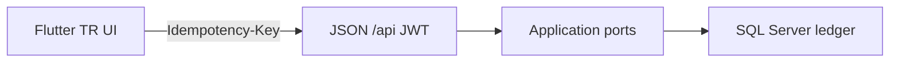

# ClearPay mobile (Flutter)

**Shipped.** This folder is the **Android / Windows / iOS** wallet app for ClearPay — same screens as the website (including Kartlarım), JWT to ASP.NET Core, **one SQL ledger**. Not a mock. Not a second cash register.

<p align="center">

[English (repo)](../../README.md) · [Türkçe](../../README.tr.md) · [Deutsch](../../README.de.md) · [Français](../../README.fr.md)

</p>

<p align="center">
  
  
  
  
  <a href="../../LICENSE"></a>
</p>

<p align="center"><b>Demo — sahte banka gateway.</b> Lisanslı e-para kuruluşu değil. Papara / FAST değil. Hive’da bakiye yok.</p>

**Aynı kişi, aynı para.** Siteye giren Halil **Razor’da** (`localhost:5153`) işler; telefonda aynı JWT. Flutter **web/Chrome yoktur** (T-087). Cookie yok: **JWT**. Kasa C# `ITransferExecutor` / `IWalletReader`. Bu klasör ikinci defter değildir.

Parent repo: [ClearPay](../../README.md). Workspace: `ClearPay.code-workspace` (site + bu klasör). `ClearPay.slnx` Flutter içermez.

---

## Picture of the build



Navy `#1B2A4A`. Footer her ekranda: **Demo — sahte banka gateway.** Relational schema (no `Wallet.Balance`): root [`README.md`](../../README.md) section **Relational schema (SQL Server)**.

| Must hold | Must not hold |
|-----------|----------------|
| JWT, pull-to-refresh, Guid `Idempotency-Key` | `UPDATE Balance`, Hive/SQLite/MySQL cüzdan, WebView cookie |

---

## What you can tap today

Site must be up: [http://localhost:5153](http://localhost:5153). Same screens as Razor (Kartlarım included).

| Operation | In the app | API |
|-----------|------------|-----|
| Sign in | Giriş — **E-posta** / **TC (demo)** | **Önce** `POST /api/token` (SQL Identity). Firebase yalnız JWT 401 ve Auth açıksa |
| Mode | Splash → **Bireysel** / **Kurumsal** (üye iş yeri değil) | JWT `account_kind`; SQL `AccountKind` |
| Register | Hesap oluştur (telefon zorunlu) | Firebase `createUser` → `POST /api/token/firebase` + Identity `PhoneNumber` |
| Forgot | **Şifremi unuttum** (her giriş sekmesi) | Firebase `sendPasswordResetEmail` veya `POST /api/password/forgot` + `/reset` |
| Summary | Özet (hamburger + sol çekmece, bakiye kartı, kısayol ızgarası; live hub + pull-to-refresh) | `GET /api/wallet` + `/hubs/wallet` |
| Transfer | Havale + onay; **QR yapıştır** | `POST /api/transfers` + `Idempotency-Key` → 201 / **409** |
| Cards | **Kartlarım** (Visa/MC/Troy yüz, son 4) | `GET/POST /api/cards` — PAN SQL yok |
| Top-up / withdraw | Yükle / Çek + demo kart | `POST /api/topup` / `withdraw` |
| Movements | Hareketler + filtre | `GET /api/movements` |
| Receipt | Dekont (kopyala + **PDF indir**) | `GET /api/receipts/{id}` + `GET /api/receipts/{id}/pdf` |
| Admin | Admin sekmesi (rol) | `/api/admin/*` |

Dev: `admin@clearpay.test` / `Deneme123`. Demo telefon (SMS yok): `5550000001` → `905550000001`. Demo TC (Mernis değil): `10000000146` → aynı admin e-posta. Firebase `CONFIGURATION_NOT_FOUND` olsa bile e-posta `POST /api/token` ile girer (T-107). **Örnek dekont** (Development seed, çift kayıt TopUp 25 ₺): `aaaaaaaa-bbbb-4ccc-8ddd-eeeeeeee0001`. Site: [http://localhost:5153/dekont/aaaaaaaa-bbbb-4ccc-8ddd-eeeeeeee0001](http://localhost:5153/dekont/aaaaaaaa-bbbb-4ccc-8ddd-eeeeeeee0001) → **PDF indir**. Flutter: giriş → Hareketler → Dekont (aynı satır) → **PDF indir** (`GET /api/receipts/{id}/pdf`, uygulama içi sahte PDF yok). Android emulator base: `http://10.0.2.2:5153`. Windows / iOS: `http://localhost:5153`. Optional `--dart-define=CLEARPAY_API=...` only — **no MySQL dart-define**. Host MySQL (`MySQL84`, `ConnectionStrings:MySql`) is tools/sidecar; this app does not add a `mysql` package or store balances (T-061 / T-077). Same path as the website: JWT → C# → SQL Server.

QR: **QR al** Özet’te `clearpay://pay?to={email}` üretir (`qr_flutter`). **QR öde** yük yapıştırır / e-posta yazar, Havale formunu doldurur, mevcut onay + `POST /api/transfers`. Kamera eklentisi yok (Windows symlink). FAST kiremiti Havale’dir — TCMB FAST değil. Piyasalar / Fatura / Kredi **Park — demo değil**.

Bireysel/Kurumsal **Firestore’a yazılmaz**. SQL Identity `AccountKind` + yerel `%LOCALAPPDATA%\ClearPay\account_kind.txt`. Flutter giriş: **önce SQL JWT** (T-107); Firebase Auth isteğe bağlı yedek. Cüzdan hâlâ SQL JWT. `firebase_core` + `firebase_auth` + `cloud_firestore` (`app_meta/ping` only). Windows native plugin skip (T-075).

## Firebase Auth (Halil)

Android `google-services.json` zaten `android/app/` (proje `clearpay-c0485`). Android Studio: **File → Open** `mobile/clearpay/android` gerekmez — `flutter run` yeterli. Console’da **Authentication → Sign-in method → E-posta/şifre** aç. SMS ekleme / Blaze yok. iOS: `ios/Runner/GoogleService-Info.plist` (aynı T-065 istemci anahtarları). Eksikse runtime: **Firebase yapılandırılmadı**.

## Interview (three sentences)

1. Same `Idempotency-Key` is the same intent: replay is **409**, the wallet is not charged twice.
2. Balance is `LedgerPair.NetOf` on SQL — this app only **GET**s the DTO.
3. Cookie is for the website; the phone carries **Bearer**, not `ClearPay.Auth`.

---

## Run (cmd)

Flutter **Command Prompt** (not PowerShell). `flutter doctor` on this machine is green (3.41.9).

```bat
cd /d D:\ClearPay\clearpay
dotnet run --project src/ClearPay.Web --launch-profile http
```

Second cmd (Android emulator — **not Chrome**):

```bat
cd /d D:\ClearPay\clearpay\mobile\clearpay
flutter doctor
flutter run -d emulator-5554
```

Windows desktop JWT (optional): `flutter run -d windows`. Store listing / HTTPS live URL: TASK-16 (you click `az login`). CI runs `dotnet test` and `flutter test`. Flutter **web platform is not configured** (T-087); the website is Razor. Language chrome TR/EN/DE/FR matches the site (T-088); not a 9th screen. Manual click list: [`docs/SMOKE.md`](../../docs/SMOKE.md).

## Firebase (client only)

Ledger stays SQL Server. **Firestore is not the cash register** — the app may write `app_meta/ping` (no amounts); money is still JWT → ASP.NET → SQL Server.

1. Same Gmail: `halilmertdeveliii@gmail.com` — [Firebase console](https://console.firebase.google.com/) → add project (or reuse ClearPay Google Cloud).
2. Command Prompt:

```bat
npm install -g firebase-tools
firebase login
cd /d D:\ClearPay\clearpay\mobile\clearpay
tool\configure-firebase.cmd
```

3. Until that runs, the app still logs in with JWT (`firebase_core` skips). Do not put a second balance in Firestore.


## License

[MIT](../../LICENSE) © 2026 Halil Mert Develi
