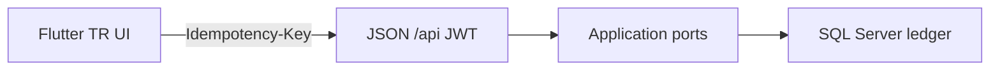

# ClearPay mobile (Flutter)

<p align="center">
  <a href="../../README.md">English (repo)</a>
  · <a href="../../README.tr.md">Türkçe</a>
  · <a href="../../README.de.md">Deutsch</a>
  · <a href="../../README.fr.md">Français</a>
</p>

<p align="center">
  
  
  
  
  <a href="../../LICENSE"></a>
</p>

<p align="center"><b>Demo — sahte banka gateway.</b> Lisanslı e-para kuruluşu değil. Papara / FAST değil. Hive’da bakiye yok.</p>

**Aynı kişi, aynı para.** Siteye giren Halil burada da giriş yapar, havale atar, yükler, dekont açar. Cookie yok: **JWT**. Kasa C# `ITransferExecutor` / `IWalletReader`. Bu klasör ikinci defter değildir.

Parent repo: [ClearPay](../../README.md). Workspace: `ClearPay.code-workspace` (site + bu klasör). `ClearPay.slnx` Flutter içermez.

---

## Picture of the build



Navy `#1B2A4A`. Footer her ekranda: **Demo — sahte banka gateway.**

| Must hold | Must not hold |
|-----------|----------------|
| JWT, pull-to-refresh, Guid `Idempotency-Key` | `UPDATE Balance`, Hive/SQLite cüzdan, WebView cookie |

---

## What you can tap today

Site must be up: [http://localhost:5153](http://localhost:5153). Same eight operations as Razor.

| Operation | In the app | API |
|-----------|------------|-----|
| Sign in | Giriş | `POST /api/token` |
| Register | Hesap oluştur | `POST /api/register` |
| Summary | Özet (pull-to-refresh) | `GET /api/wallet` |
| Transfer | Havale + onay | `POST /api/transfers` + `Idempotency-Key` → 201 / **409** |
| Top-up / withdraw | Yükle / Çek + demo kart | `POST /api/topup` / `withdraw` |
| Movements | Hareketler + filtre | `GET /api/movements` |
| Receipt | Dekont | `GET /api/receipts/{id}` |
| Admin | Admin sekmesi (rol) | `/api/admin/*` |

Dev: `admin@clearpay.test` / `Deneme123`. Android emulator base: `http://10.0.2.2:5153`. Windows / iOS: `http://localhost:5153`.

## Interview (three sentences)

1. Same `Idempotency-Key` is the same intent: replay is **409**, the wallet is not charged twice.
2. Balance is `LedgerPair.NetOf` on SQL — this app only **GET**s the DTO.
3. Cookie is for the website; the phone carries **Bearer**, not `ClearPay.Auth`.

---

## Run (cmd)

Flutter **Command Prompt** (not PowerShell). `flutter doctor` on this machine is green (3.41.9).

```bat
cd /d C:\Users\clt\Projects\clearpay
dotnet run --project src/ClearPay.Web --launch-profile http
```

Second cmd:

```bat
cd /d C:\Users\clt\Projects\clearpay\mobile\clearpay
flutter doctor
flutter build windows
flutter run -d windows
```

Store listing / HTTPS live URL: TASK-16 (you click `az login`). CI stays `dotnet test`.

## Firebase (client only)

Ledger stays SQL Server. Firebase is **not** Auth/Firestore wallet.

1. Same Gmail: `halilmertdeveliii@gmail.com` — [Firebase console](https://console.firebase.google.com/) → add project (or reuse ClearPay Google Cloud).
2. Command Prompt:

```bat
npm install -g firebase-tools
firebase login
cd /d C:\Users\clt\Projects\clearpay\mobile\clearpay
tool\configure-firebase.cmd
```

3. Until that runs, the app still logs in with JWT (`firebase_core` skips). Do not put a second balance in Firestore.

## License

[MIT](../../LICENSE) © 2026 Halil Mert Develi
